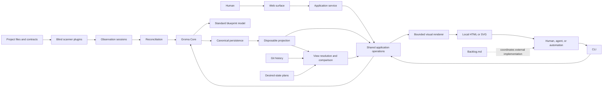

# Groma Architecture

Groma's architectural sources have distinct roles:

- [MANIFESTO.md](MANIFESTO.md) is the constitution for product and architectural
  principles and takes precedence when a principle is in question.
- The canonical workspace under [`groma/`](groma/) is the detailed source of truth for
  component identity, containment, intent, inputs, outputs, actions, extension metadata,
  and ordinary relationships.
- This document is the cross-component navigator: it retains context, topology,
  sequences, data-plane orientation, and scheduled decisions without repeating the
  canonical component field ledger.

The contextual and sequence views below are deliberately not a second field ledger.
Implementation behavior remains documented beside [`src/`](src/), and presentation follows
the [brand guide](brand/README.md) and [visual style direction](brand/STYLE.md). Layout,
folding, focus, zoom, and theme are disposable projection state rather than canonical
meaning.

## System Context and High-Level Topology

Groma sits between projects being built and the humans, agents, and automation reasoning
about them. Scanners observe project files and contracts without seeing the existing
blueprint. Groma reconciles those observations with durable intent, exposes one shared
application model through CLI and web surfaces, reconstructs bounded visual projections,
and uses Git revisions and plan overlays for past and future views. Backlog.md coordinates
implementation work outside Groma.



The CLI-to-renderer path carries bounded shared-operation data and open/return lifecycle
only. A renderer never reads canonical storage directly or creates another semantic path.

## Canonical Orientation

The self-blueprint contains nine root components:

| Root                           | Orientation                                                                     |
| ------------------------------ | ------------------------------------------------------------------------------- |
| Core                           | Technology-neutral graph, transaction, query, observation, and plugin contracts |
| Official Host                  | Default local composition and bootstrap behavior                                |
| Standard Blueprint Model       | The official recursively composable component vocabulary                        |
| Canonical Persistence          | Deterministic local intent, evidence, alias, journal, and migration state       |
| Projection                     | Reconstructable indexes, bounded queries, and visual projection                 |
| Scanning and Reconciliation    | Blind observation and intent-preserving reconciliation                          |
| Planning and History           | Desired-state overlays, comparison, and historical views                        |
| CLI, Service, and Web Surfaces | Shared operations presented to agents and humans                                |
| Plugin Development             | Public SDK, reusable conformance, and scaffolding                               |

Every non-root component has exactly one canonical parent. Ordinary relationships are
separate from containment and may cross any root boundary. The
[noncanonical component-model examples](docs/component-model-examples.md) preserve the
Recursive Shopify and Ordering System teaching examples without adding them to Groma's
self-blueprint.

## Canonical Data Planes

| Plane    | Canonical responsibility                                                 | Changes through                                   |
| -------- | ------------------------------------------------------------------------ | ------------------------------------------------- |
| Intent   | Components, containment, curated meaning, and declared relationships     | Semantic human or agent operations                |
| Evidence | Completed observations, provenance, and coverage                         | Valid completed scan sessions and reconciliation  |
| Binding  | Automatic, explicit, ignored, and superseded evidence-to-intent mappings | Groma-owned reconciliation and explicit decisions |
| Alias    | Stable identity continuity after explicit merges and key migrations      | Alias-aware semantic transactions                 |
| Plan     | Ordered sparse desired-state overlays                                    | Plan operations, never implementation commands    |

Projection joins these planes into bounded current, historical, and planned views. It is
reconstructable and never canonical. Detailed ownership and constraints remain on the
canonical component cards rather than in this table.

## Primary Workflow Sequences

| Journey                 | Primary sequence                                                                                                               | Preserved boundary                                                                        |
| ----------------------- | ------------------------------------------------------------------------------------------------------------------------------ | ----------------------------------------------------------------------------------------- |
| First useful blueprint  | `groma init -> groma scan -> groma -> bounded current view -> local visual blueprint`                                          | Local, understandable, no upload or AI call by default                                    |
| Initialize              | Host Phase 0 -> detect no workspace -> init -> create canonical resources -> load Phase 1 -> validate                          | Initialization works before a workspace exists                                            |
| Create or edit intent   | CLI or web -> shared operation -> current revision -> model invariants -> canonical transaction -> projection event            | Never writes evidence or guesses identity                                                 |
| Scan and reconcile      | Registry -> blind finite session -> completed snapshot -> deterministic binding -> evidence transaction -> one generation      | Failure or ambiguity infers no absence and erases no intent                               |
| Local visual navigation | Bounded current read -> projected nodes -> presentation budget -> layout/folding -> focus, expand, trace, inspect              | Visual state is disposable; detail remains reachable                                      |
| Plans and comparison    | Current + ordered overlays -> cumulative view; selected assertions + current + aliases -> scoped diff                          | Plans state desired truth, never work commands; unrelated work does not block convergence |
| History                 | `rev:<ref>` -> historical canonical resources -> temporary projection -> read-only view                                        | Git semantics stay outside Core                                                           |
| Web navigation          | Browser -> application service -> bounded query/subgraph -> layout -> incremental expansion                                    | Browser never requests or lays out the whole organization graph                           |
| Backlog self-hosting    | Groma plan -> linked Backlog milestone -> external tasks -> implementation -> scan/reconcile -> plan diff -> milestone outcome | Backlog owns work; Groma owns architectural state                                         |

These sequences explain cross-component flow; they do not replace the canonical actions,
inputs, outputs, relationships, or constraints that make each step precise.

## Inspect the Blueprint

Build the public executable before inspecting a source checkout:

```sh
bun run build
./dist/groma
./dist/groma component roots --limit 100
./dist/groma blueprint search "reconciliation" --limit 20
./dist/groma blueprint traverse <component-id> --direction both --depth 2 --limit 20
./dist/groma blueprint export --limit 7
```

An installed distribution uses the same commands with `groma` in place of
`./dist/groma`. Export is explicitly paged: pass each returned cursor unchanged until
`hasMore` is false. Cursors are generation-bound, so a stale result requires restarting
from the first page.

Canonical Markdown is readable for review, but architectural meaning changes only through
supported public Groma operations. Do not hand-edit generated intent shards or derive
identity from a component name, path, parent, or migration seed key.

## Relationship Declarations

The migration preserves all 87 documented relationship declarations as structured
`groma.md/relationship-declarations` metadata on their owning components. Every record
retains its stable key and exact source text in one of four states:

- `edge` means all declared endpoints are explicit and materialized as one or more
  canonical `relates-to` edges whose IDs the declaration records;
- `partial` means one or more exact endpoints are materialized and recorded while an
  unresolved remainder of the declaration stays visible;
- `ambiguous` means no endpoint is sufficiently defensible to materialize without a
  guess;
- `constraint` means the declaration is an architectural boundary rather than an edge.

Both `edge` and `partial` declarations have a nonempty `edgeIds` list. `ambiguous` and
`constraint` declarations have no edge IDs. Missing, collective, or open-ended endpoints
never receive synthetic components merely to make the graph appear complete.

The neutral `relates-to` owner-to-target direction records declaration ownership and
serialization. It does **not** claim dependency, control, or data-flow direction. Use
`blueprint traverse <id> --direction both ...` when exploring adjacency unless the
declaration text itself gives the semantic direction.

## Invariants, Open Decisions, and Exclusions

This navigator intentionally does not restore a parallel invariant list. The
[Manifesto](MANIFESTO.md) states the governing invariants, while the canonical **Model
Invariants** component and individual card constraints record detailed enforcement and
ownership. Inspect them through the public search, exact-read, and traversal commands.

Nine decisions remain deliberately unresolved until their scheduled evidence and freeze
points. Earlier work must not guess them.

| Decision                                                     | Earliest evidence                                 | Freeze point       |
| ------------------------------------------------------------ | ------------------------------------------------- | ------------------ |
| Exact standard state taxonomy and display precedence         | Self-scan and drift cases                         | End of Iteration 2 |
| External observation transport grammar                       | Synthetic scanner and agent submission            | End of Iteration 3 |
| Plaintext grammar details                                    | Real agent use across scanning and binding        | End of Iteration 2 |
| Evidence shard fanout beyond the initial 256-bucket strategy | 500,000-observation fixture                       | End of Iteration 3 |
| Default CLI page size                                        | Real query and comparison benchmarks              | End of Iteration 3 |
| Plan ordering UX                                             | Concurrent plan dogfood                           | End of Iteration 3 |
| Event batching thresholds                                    | Viewer and scan load tests                        | End of Iteration 4 |
| Local-artifact main-layer, focus, and expansion budgets      | Iteration 2 local visual prototype                | End of Iteration 2 |
| Browser retained-node budgets                                | Iteration 3 scale evidence and browser load tests | End of Iteration 4 |

The following are explicit v0.1 exclusions rather than unresolved questions:

- hosted coordination and multi-host writes;
- plugin marketplace and sandboxing;
- blueprint federation and importing;
- branching alternative futures;
- plan application or code generation;
- agent approval and permission workflows;
- organization-wide global canvas layout.

## Resolve Disagreements

When the blueprint, implementation, or this navigator appears to disagree:

1. Check the Manifesto first. If the disagreement changes a principle, stop for an
   explicit product decision.
2. Inspect the affected components and relationships through bounded public reads, and
   record the stable component, item, declaration, and edge IDs involved.
3. Decide which layer is wrong: canonical architectural meaning, current implementation,
   or this high-level navigator. Scanner evidence alone does not replace curated intent.
4. Change canonical meaning only through supported public operations. Change code for
   implementation drift, and change this navigator only for incorrect cross-component
   context.
5. Verify the result. If identity or endpoint resolution remains ambiguous, fail closed.

## Verify and Refresh the Frozen Baseline

The self-blueprint verifier copies canonical bytes, uses fresh compiled public CLI
processes to page a bounded export, checks structure and declaration-edge correspondence,
deletes and rebuilds disposable projection state, and proves the canonical copy stayed
byte-identical:

```sh
bun run verify:self-blueprint
bun run check
```

A baseline refresh is deliberate and review-only:

1. Edit canonical meaning through the compiled public CLI using current revisions.
2. Review `groma diff`. Until that comparison command is delivered, review
   `git diff -- groma` together with a bounded public `blueprint export`.
3. Run
   `bun run tests/iteration-1b/verify-self-blueprint.ts --report-baseline` to print the
   observed counts, declaration statuses, and opaque digests.
4. Review that report and deliberately update the fixed `expectedDigests` summary in the
   verifier. The report never writes or updates expectations automatically.
5. Run normal `bun run verify:self-blueprint` to enforce the refreshed baseline.

`--report-baseline` may appear before or after `--executable=<path>`. It bypasses only
frozen digest equality; structural counts, status rules, the declaration-edge bijection,
projection rebuild, and byte-identical canonical proof still run. A frozen digest is a
change detector, not an architectural source.
