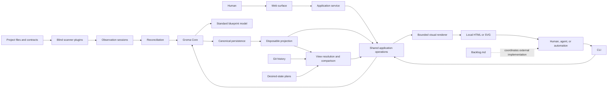

# Groma Architecture

This document is the guided tour: it explains how Groma's pieces fit together and where the
implementation currently stands. It sits between two other sources, and each has a distinct
role:

- [MANIFESTO.md](MANIFESTO.md) is the constitution. When a principle is in question, it wins.
- The canonical workspace under [`groma/`](groma/) is the detailed source of truth for every
  component: identity, containment, intent, inputs, outputs, actions, extension metadata, and
  ordinary relationships. This file deliberately does not repeat that per-component detail.
- This document keeps the cross-component context: topology, workflows, data planes, and
  scheduled decisions.

Implementation behavior is documented beside [`src/`](src/), and presentation follows the
[brand guide](brand/README.md) and [visual style direction](brand/STYLE.md). Layout, folding,
focus, zoom, and theme are disposable drawing state — they are never part of the architectural
meaning.

## The Big Picture

Groma sits between the projects being built and the humans, agents, and automation reasoning
about them. The flow, end to end:

1. **Scanners** look at project files and contracts. They never see the existing blueprint.
2. Each scan runs as a finite **observation session** whose results are kept only if the
   session completes.
3. **Reconciliation** joins those observations with the durable intent people have written,
   without erasing any of it.
4. Humans and agents work through one shared set of **application operations**, reached from
   the CLI or the web surface.
5. **Projections** (rebuildable indexes and views) answer bounded queries and feed the visual
   renderer, which produces a local HTML or SVG artifact.
6. **Git revisions** provide views of the past; **plans** describe the desired future.
   Backlog.md coordinates the implementation work outside Groma.



The CLI-to-renderer path carries bounded shared-operation data and an open/return lifecycle,
nothing more. A renderer never reads canonical storage directly and never becomes a second
semantic path into the model.

## The Nine Curated Roots

Groma describes itself with its own blueprint. The nine hand-curated roots below organize its
intended architecture, and every curated non-root component lives inside exactly one of them.

The curated self-blueprint contains nine root components:

| Root                           | Orientation                                                                     |
| ------------------------------ | ------------------------------------------------------------------------------- |
| Core                           | Technology-neutral graph, transaction, query, observation, and plugin contracts |
| Official Host                  | Default local composition and bootstrap behavior                                |
| Standard Blueprint Model       | The official recursively composable component vocabulary                        |
| Canonical Persistence          | Deterministic local intent, evidence, alias, journal, and migration state       |
| Projection                     | Reconstructable indexes, bounded queries, and visual projection                 |
| Scanning and Reconciliation    | Blind observation and intent-preserving reconciliation                          |
| Planning and History           | Desired-state overlays, comparison, and historical views                        |
| CLI, Service, and Web Surfaces | Shared operations presented to agents and humans                                |
| Plugin Development             | Public blind-scanner authoring contracts                                        |

Scans also add source-owned top-level components when package, source-boundary, or external-module
evidence does not justify canonical containment. Those observed roots remain visibly distinct from
the curated hierarchy and are a density input for the bounded visual layer; Groma does not guess a
parent merely to preserve the count of nine. Every curated non-root component has exactly one
canonical parent. Ordinary relationships are separate from containment and may cross any root
boundary. The
[noncanonical component-model examples](docs/component-model-examples.md) keep the Recursive
Shopify and Ordering System teaching examples available without adding them to Groma's
self-blueprint.

## The Five Data Planes

Groma separates durable state into five planes so that machine evidence can never quietly
overwrite human meaning. Each plane changes only through its own channel:

| Plane    | What it holds                                                            | Changes through                                   |
| -------- | ------------------------------------------------------------------------ | ------------------------------------------------- |
| Intent   | Components, containment, curated meaning, and declared relationships     | Semantic human or agent operations                |
| Evidence | Completed observations, provenance, and coverage                         | Valid completed scan sessions and reconciliation  |
| Binding  | Automatic, explicit, ignored, and superseded evidence-to-intent mappings | Groma-owned reconciliation and explicit decisions |
| Alias    | Stable identity continuity after explicit merges and key migrations      | Alias-aware semantic transactions                 |
| Plan     | Ordered sparse desired-state overlays                                    | Plan operations, never implementation commands    |

Projection joins these planes into bounded current, historical, and planned views. A projection
is always rebuildable and never canonical. Detailed ownership rules and constraints live on the
canonical component cards, not in this table.

## Primary Workflows

These sequences explain how the pieces cooperate. They do not replace the canonical actions,
inputs, outputs, relationships, or constraints that make each step precise.

| Journey                 | Primary sequence                                                                                                                              | Preserved boundary                                                                        |
| ----------------------- | --------------------------------------------------------------------------------------------------------------------------------------------- | ----------------------------------------------------------------------------------------- |
| First useful blueprint  | `groma init -> groma scan -> groma -> bounded current view -> local visual blueprint`                                                         | Local, understandable, no upload or AI call by default                                    |
| Initialize              | Host Phase 0 -> detect no workspace -> init -> create canonical resources -> load Phase 1 -> validate                                         | Initialization works before a workspace exists                                            |
| Create or edit intent   | CLI or web -> shared operation -> current revision -> model invariants -> canonical transaction -> projection event                           | Never writes evidence or guesses identity                                                 |
| Scan and reconcile      | Registered project -> confined project view -> blind finite session -> deterministic binding -> atomic evidence transaction -> one generation | Failure or ambiguity infers no absence and erases no intent                               |
| Local visual navigation | Bounded current read -> projected nodes -> presentation budget -> layout/folding -> focus, expand, trace, inspect                             | Visual state is disposable; detail remains reachable                                      |
| Plans and comparison    | Current + ordered overlays -> cumulative view; selected assertions + current + aliases -> scoped diff                                         | Plans state desired truth, never work commands; unrelated work does not block convergence |
| History                 | `rev:<ref>` -> historical canonical resources -> temporary projection -> read-only view                                                       | Git semantics stay outside Core                                                           |
| Web navigation          | Browser -> application service -> bounded query/subgraph -> layout -> incremental expansion                                                   | Browser never requests or lays out the whole organization graph                           |
| Backlog self-hosting    | Groma plan -> linked Backlog milestone -> external tasks -> implementation -> scan/reconcile -> plan diff -> milestone outcome                | Backlog owns work; Groma owns architectural state                                         |

## Where Scanning Stands Today

`groma scan` now runs the complete local observation path. With the initialized default project,
the CLI configures the built-in scanner automatically; additional projects or scanners require an
explicit unambiguous selection. The Host buffers one finite observation session in memory and
passes only a completed snapshot to reconciliation. Reconciliation maintains stable source-owned
bindings and publishes evidence plus canonical changes in one atomic transaction.

A failed, cancelled, timed-out, malformed, or ambiguous scan publishes nothing, so curated intent
and the last complete blueprint remain untouched. An unchanged completed scan is a byte no-op even
across process restarts.

### The first scanner: `official.typescript`

The first built-in contribution is the requirement-free `official.typescript` scanner. What it
does:

- walks only the project resource surface the Host confines it to;
- parses TypeScript and JavaScript inertly — it never executes project code;
- emits bounded, source-local observations for: packages, source boundaries, explicit public
  callable exports, uniquely resolved value and type-only cross-boundary imports, defensible
  static Bun routes, and raw documentation;
- resolves static TypeScript path aliases and package import maps only when they identify
  exactly one inventoried resource.

What it deliberately leaves out:

- Generated, dependency, vendor, build, test, configured-excluded, and supported ignored
  resources are outside its declared production universe.
- An unsafe root policy makes the scope empty and the coverage partial; an unsafe nested
  policy makes that subtree opaque.
- Any other unsupported, dynamic, malformed, or ambiguous evidence is omitted, and the
  affected coverage is reported as partial. The scanner reports less rather than guessing.
- It never reads canonical intent, never emits canonical IDs or bindings, and never turns
  prose into architecture.

Stable observation keys derive from logical source identity; the exact resource bytes and
UTF-8 ranges are kept as evidence provenance.

### Interruption and recovery

Cancellation ends the bounded in-memory scan before publication when possible. Once atomic
publication starts, the runtime waits for its actual result instead of reporting cancellation while
a detached write continues. There is no provisional journal, heartbeat, quarantine lane, or replay
protocol; incomplete observations are disposable and canonical transaction recovery owns only the
publication boundary.

## Inspect the Blueprint

Build the public executable before inspecting a source checkout:

```sh
bun run build
./dist/groma
./dist/groma component roots --limit 100
./dist/groma blueprint search "reconciliation" --limit 20
./dist/groma blueprint traverse <component-id> --direction both --depth 2 --limit 20
./dist/groma blueprint export --limit 7
```

An installed distribution uses the same commands with `groma` in place of `./dist/groma`.
Export is explicitly paged: pass each returned cursor unchanged until `hasMore` is false.
Cursors are bound to one generation of the projection, so a stale result means starting again
from the first page.

The canonical Markdown is readable for review, but architectural meaning changes only through
supported public Groma operations. Do not hand-edit generated intent shards, and do not derive
identity from a component's name, path, parent, or migration seed key — only the stable ID is
identity.

## Relationship Declarations

When the hand-written architecture overview was migrated into the canonical workspace, all 87
documented relationship declarations were preserved as structured
`groma.md/relationship-declarations` metadata on their owning components. Every record keeps
its stable key and exact source text, in one of four states:

- `edge` — all declared endpoints are explicit and materialized as one or more canonical
  `relates-to` edges whose IDs the declaration records;
- `partial` — at least one exact endpoint is materialized and recorded, while the unresolved
  remainder of the declaration stays visible;
- `ambiguous` — no endpoint is defensible enough to materialize without guessing;
- `constraint` — the declaration is an architectural boundary rule, not an edge.

Both `edge` and `partial` declarations have a nonempty `edgeIds` list; `ambiguous` and
`constraint` declarations have none. Missing, collective, or open-ended endpoints never receive
synthetic components just to make the graph look complete.

The neutral `relates-to` owner-to-target direction records which component owns and serializes
the declaration. It does **not** claim dependency, control, or data-flow direction. When
exploring adjacency, use `blueprint traverse <id> --direction both ...` unless the declaration
text itself states the semantic direction.

## Invariants, Open Decisions, and Exclusions

This document intentionally does not maintain a parallel list of invariants. The
[Manifesto](MANIFESTO.md) states the governing invariants, and the canonical **Model
Invariants** component and individual card constraints record detailed enforcement and
ownership. Inspect them through the public search, exact-read, and traversal commands.

Nine decisions are deliberately unresolved until their scheduled evidence exists. Earlier work
must not guess them:

| Decision                                                     | Earliest evidence                                 | Freeze point       |
| ------------------------------------------------------------ | ------------------------------------------------- | ------------------ |
| Exact standard state taxonomy and display precedence         | Self-scan and drift cases                         | End of Iteration 2 |
| External observation transport grammar                       | Synthetic scanner and agent submission            | End of Iteration 3 |
| Plaintext grammar details                                    | Real agent use across scanning and binding        | End of Iteration 2 |
| Evidence shard fanout beyond the initial 256-bucket strategy | 500,000-observation fixture                       | End of Iteration 3 |
| Default CLI page size                                        | Real query and comparison benchmarks              | End of Iteration 3 |
| Plan ordering UX                                             | Concurrent plan dogfood                           | End of Iteration 3 |
| Event batching thresholds                                    | Viewer and scan load tests                        | End of Iteration 4 |
| Local-artifact main-layer, focus, and expansion budgets      | Iteration 2 local visual prototype                | End of Iteration 2 |
| Browser retained-node budgets                                | Iteration 3 scale evidence and browser load tests | End of Iteration 4 |

The following are explicit v0.1 exclusions rather than unresolved questions:

- hosted coordination and multi-host writes;
- plugin marketplace and sandboxing;
- blueprint federation and importing;
- branching alternative futures;
- plan application or code generation;
- agent approval and permission workflows;
- organization-wide global canvas layout.

## Resolve Disagreements

When the blueprint, the implementation, or this document appear to disagree:

1. Check the Manifesto first. If the disagreement changes a principle, stop and ask for an
   explicit product decision.
2. Inspect the affected components and relationships through bounded public reads, and record
   the stable component, item, declaration, and edge IDs involved.
3. Decide which layer is wrong: the canonical architectural meaning, the current
   implementation, or this high-level document. Scanner evidence alone does not replace
   curated intent.
4. Change canonical meaning only through supported public operations. Change code for
   implementation drift. Change this document only when its cross-component context is
   incorrect.
5. Verify the result. If identity or endpoint resolution is still ambiguous, fail closed.
