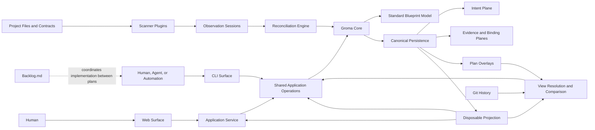
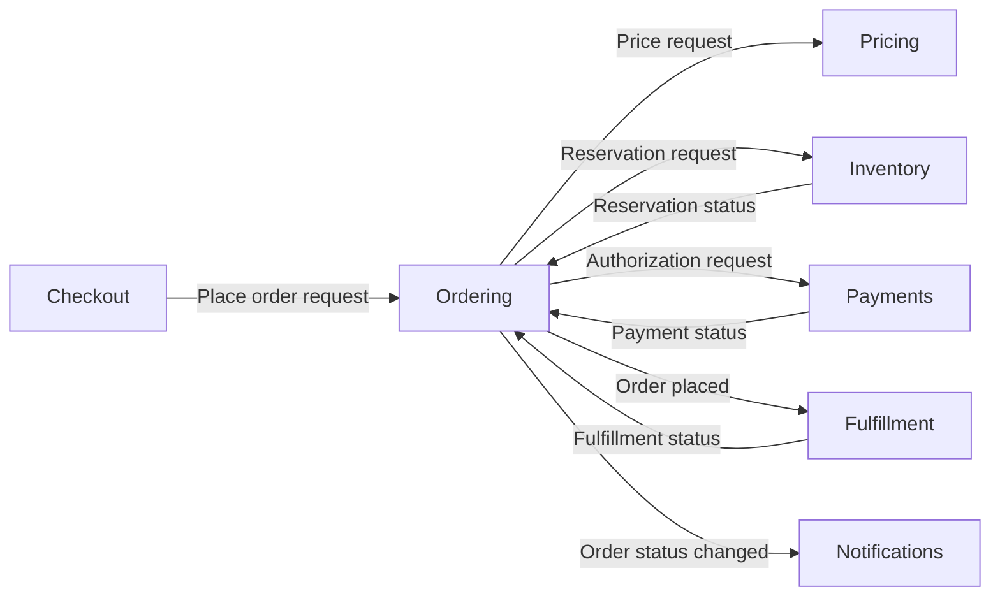
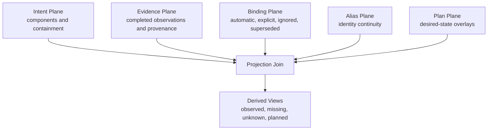

# Groma Architecture Overview

This document is the handmade precursor to Groma's self-blueprint. It describes the
system at the level of intent: what each architectural part is responsible for, what
it receives and produces, and how it relates to the rest of the system.

Until Groma can model itself, this document is the architectural source for bootstrap
work. After the self-blueprint exists under `groma/`, this document remains the human
entry point and the generated blueprint becomes the detailed source of truth.

All decisions in this overview are subordinate to [MANIFESTO.md](MANIFESTO.md).

## Blueprint Legend

Every component card uses these fields:

- **Seed key:** temporary stable handle used by this document. It is not a future
  Groma entity ID.
- **Type:** an open model-owned token describing the component's architectural role.
- **Parent:** the single structural parent component, or `None` for a root.
- **First delivery:** the first iteration expected to make the component real.
- **Intent:** why the component exists, independent of implementation technology.
- **Inputs:** concepts or information the component receives.
- **Outputs:** concepts or information the component produces.
- **Actions:** responsibilities the component performs.
- **Relationships:** architectural dependencies and collaborations.

The planned delivery iterations are:

| Iteration | Architectural outcome                                            |
| --------- | ---------------------------------------------------------------- |
| 1A        | Correctness walking skeleton and minimal persistence             |
| 1B        | Official host, projection, validation, and manual self-blueprint |
| 2         | Scanning, evidence, binding, and reconciliation                  |
| 3         | Plans, Git history, and architectural comparison                 |
| 4         | Long-lived application service and web viewer                    |
| 5         | Web editing and complete self-hosting                            |

## v0.1 Component Vocabulary

The blueprint is a workspace containing one or more root components. Every
architectural node beneath that workspace uses the same recursively composable model:

```text
Component
├── type
├── parent?              # absent for roots
├── intent
├── inputs
├── outputs
├── actions
└── relationships
```

Type is an open token rather than a closed hierarchy. For example, a Shopify blueprint
may have `Shop` and `Users` root components of type `domain`, with recursively nested
components beneath them. A parent may contain children of its own type or any other
type. Each non-root component has exactly one parent; roots have none; containment
cycles are invalid. A component may additionally have any number of ordinary
relationships, including relationships to components in other branches.

`parent` is the Standard Model's single-reference view of structural containment. The
model maps and validates that structure over Core's technology-neutral graph
contracts; Core does not learn component types or hierarchy policy.

`kind` and `type` have different scopes. Graph-level `kind` identifies the entity as a
standard-model `component` and lets codecs reject a document for the wrong entity
kind. Model-level `type` is the open architectural role chosen for that component,
such as `domain`, `service`, or `component`.

Type and parent are structural metadata. The model intentionally limits structured
component meaning to five concepts: intent, inputs, outputs, actions, and
relationships. This is enough to make a component understandable and connectable
without forcing users or scanners to fill in a large architectural taxonomy. Other
useful concepts map onto this vocabulary until real usage justifies promoting them:

| Richer concept     | v0.1 representation                                      |
| ------------------ | -------------------------------------------------------- |
| State              | Behavioral prose in the component body                   |
| Requirements       | `requires` relationships                                 |
| Guarantees         | Optional guarantees section in the component body        |
| Triggers           | Usually implied by an input and described by its action  |
| Effects            | Outputs, relationships, or action prose                  |
| Failure outcomes   | Architecturally meaningful outputs                       |
| Configuration      | An input when it matters to other components             |
| Commands           | Inputs that request an action                            |
| Events             | Inputs or outputs representing something that happened   |
| Metrics and status | Outputs when another component or operator consumes them |

Inputs and outputs are the v0.1 connection points. A later model may describe them as
typed ports, but v0.1 does not require users to classify flow, protocol, multiplicity,
or control semantics.

Every scanner contribution is optional and partial. A scanner may observe only a
component candidate, only actions, or only a relationship. It does not fail the
contract by omitting inputs or outputs, and it is never expected to infer intent,
state, guarantees, or business meaning.

## System Context

Groma sits between systems being built and the people or agents reasoning about those
systems.

- Project files and contracts are observed by scanners.
- Scanners send one-way observation sessions to Groma.
- Groma reconciles observations with durable architectural intent.
- Humans primarily explore the aggregate blueprint through the web interface.
- Humans, agents, and automation use the CLI for complete semantic access.
- Git retains past blueprint states.
- Groma plans describe future desired states.
- Backlog.md coordinates implementation work between those desired states.

Groma does not implement planned changes and does not expose source-code detail as the
architecture itself.

## High-Level Architecture



## Architectural Component Tree

The nine sections below are root components of the Groma blueprint. They have no
parent; their former role as dedicated containers is now expressed by the same
component model used everywhere else.

| Root component                 | Seed key                   | Type     | Parent |
| ------------------------------ | -------------------------- | -------- | ------ |
| Core                           | `core`                     | `domain` | `None` |
| Official Host                  | `official-host`            | `domain` | `None` |
| Standard Blueprint Model       | `standard-blueprint-model` | `domain` | `None` |
| Canonical Persistence          | `canonical-persistence`    | `domain` | `None` |
| Projection                     | `projection`               | `domain` | `None` |
| Scanning and Reconciliation    | `scanning-reconciliation`  | `domain` | `None` |
| Planning and History           | `planning-history`         | `domain` | `None` |
| CLI, Service, and Web Surfaces | `surfaces`                 | `domain` | `None` |
| Plugin Development             | `plugin-development`       | `domain` | `None` |

The table rows and their section introductions are intentionally sparse root component
definitions; the standard model does not require a full card. Every card nested under
a root uses type `component` unless the card explicitly says otherwise. The `Parent`
field is structural containment; the `Relationships` field remains the unrestricted
collaboration graph.

### 1. Core

Core contains technology-neutral contracts and invariants. It does not know about
filesystems, Markdown, Git, SQLite, CLI syntax, scanner processes, or browsers.

#### Graph Kernel

- **Seed key:** `graph-kernel`
- **Type:** `component`
- **Parent:** Core
- **First delivery:** 1A
- **Intent:** Give every architectural concept stable identity and a common graph
  representation without prescribing a storage or surface technology.
- **Inputs:** Entity definitions; relation definitions; identity requests; registered
  model invariants.
- **Outputs:** Stable entities; resolvable relations; identity and alias results;
  invariant diagnostics.
- **Actions:** Mint identities; resolve aliases; validate graph references; expose
  bounded graph primitives.
- **Relationships:** Used by every model and application operation; delegates
  model-specific meaning to the Standard Blueprint Model.

#### Transaction Engine

- **Seed key:** `transaction-engine`
- **Type:** `component`
- **Parent:** Core
- **First delivery:** 1A
- **Intent:** Make semantic graph changes deterministic, conflict-aware, atomic at the
  capability boundary, and observable by projections and surfaces.
- **Inputs:** Proposed mutations; expected content revisions; registered invariants;
  canonical-store capability.
- **Outputs:** Committed graph generation; entity changes; conflict or validation
  diagnostics; typed events.
- **Actions:** Validate mutations; compare revisions; coordinate commits; publish
  generation changes; recover transaction outcomes through provider contracts.
- **Relationships:** Governs all writes from application operations and reconciliation;
  relies on storage providers without knowing their technology.

#### Query and Event Contracts

- **Seed key:** `query-event-contracts`
- **Type:** `component`
- **Parent:** Core
- **First delivery:** 1A
- **Intent:** Provide bounded, generation-aware reads and change notifications that
  work for both short-lived commands and long-lived surfaces.
- **Inputs:** Query definitions; page limits; cursors; committed transaction events.
- **Outputs:** Bounded result pages; opaque continuation cursors; typed graph events;
  cursor-invalid diagnostics.
- **Actions:** Validate query bounds; associate results with generations; route events;
  describe recovery after missed generations.
- **Relationships:** Implemented by projection providers; consumed by CLI, service,
  comparison, and web components.

#### Observation Contract

- **Seed key:** `observation-contract`
- **Type:** `component`
- **Parent:** Core
- **First delivery:** 2
- **Intent:** Define safe finite sessions through which blind scanners report evidence
  without accessing or mutating the existing blueprint.
- **Inputs:** Session metadata; observations; provenance units; heartbeats; completion
  or failure signals.
- **Outputs:** Provisional session events; validated completed snapshots; failure and
  abandonment diagnostics.
- **Actions:** Fence epochs; validate scope and keys; maintain leases; reject
  contradictions; expose completion to reconciliation.
- **Relationships:** Produced by Scanner Runtime; consumed by Reconciliation Engine;
  persisted through the scan journal provider.

#### Plugin Runtime

- **Seed key:** `plugin-runtime`
- **Type:** `component`
- **Parent:** Core
- **First delivery:** 1B
- **Intent:** Compose replaceable capabilities while making dependencies,
  cardinalities, lifecycle, and incompatibilities explicit.
- **Inputs:** Host bootstrap registry; plugin manifests; capability registrations;
  runtime configuration.
- **Outputs:** Resolved capability graph; lifecycle events; startup diagnostics.
- **Actions:** Resolve Phase 0 and Phase 1 plugins; detect cycles and collisions;
  enforce capability cardinality; start, cancel, and stop plugins.
- **Relationships:** Bootstrapped by Official Host; supplies all built-in and optional
  plugins to Core and shared application operations.

### 2. Official Host

The official host is the composition root for the default local distribution. It is
not part of Core.

#### Default Host

- **Seed key:** `default-host`
- **Type:** `component`
- **Parent:** Official Host
- **First delivery:** 1A
- **Intent:** Start Groma in local CLI, service, and initialization contexts without
  embedding default technologies into Core.
- **Inputs:** Process context; Phase 0 registry; discovered workspace configuration;
  cancellation signals.
- **Outputs:** Running plugin graph; selected surface; startup and shutdown results.
- **Actions:** Start Phase 0; detect workspace presence; load Phase 1; dispatch the
  selected surface; coordinate shutdown.
- **Relationships:** Creates Plugin Runtime; supplies bootstrap providers; hosts CLI
  and application service plugins.

#### Bootstrap Configuration

- **Seed key:** `bootstrap-configuration`
- **Type:** `component`
- **Parent:** Official Host
- **First delivery:** 1B
- **Intent:** Discover and load configuration before the runtime plugin graph exists,
  while keeping filesystem and YAML assumptions replaceable.
- **Inputs:** Bootstrap resource context; config-discovery providers; config-parser
  providers.
- **Outputs:** Workspace locator; typed base configuration; requested runtime plugins.
- **Actions:** Search for configuration; report no-workspace state; parse configuration;
  reject ambiguous or incompatible bootstrap providers.
- **Relationships:** Runs in Plugin Runtime Phase 0; official profile uses Local
  Resources and YAML Configuration providers.

#### Plugin Package Manager

- **Seed key:** `plugin-package-manager`
- **Type:** `component`
- **Parent:** Official Host
- **First delivery:** 1B for local packages; remote acquisition after the runtime API
  is proven
- **Intent:** Install, select, reproduce, and update distributable plugin packages
  without exposing package-manager technology to Core or modifying observed projects.
- **Inputs:** Package source; user or blueprint scope; package manifest; project trust;
  committed declarations and exact lock entries.
- **Outputs:** Materialized package; enabled plugin entry points; integrity and
  compatibility diagnostics; deterministic lock changes.
- **Actions:** Resolve npm, Git, and path sources; verify trust and integrity; install
  missing locked packages; filter package contributions; update and remove packages.
- **Relationships:** Runs in Official Host; supplies plugin entry points to Plugin
  Runtime; uses Local Resource Provider and host-level acquisition capabilities;
  never changes a scanned project's `package.json`, lockfiles, or dependencies.

### 3. Standard Blueprint Model

The official model is a required built-in plugin rather than a Core assumption.

#### Standard Model

- **Seed key:** `standard-model`
- **Type:** `component`
- **Parent:** Standard Blueprint Model
- **First delivery:** 1A
- **Intent:** Express an intentionally small architectural vocabulary through
  recursively nested components, open types, intent, inputs, outputs, actions,
  relationships, lifecycle, and desired state.
- **Inputs:** Partial semantic entity mutations; extension metadata; relation-type
  registrations.
- **Outputs:** Validated partial or complete model entities; model-specific views;
  semantic diagnostics.
- **Actions:** Define the minimal entity vocabulary; normalize semantic documents;
  preserve omitted fields; resolve structural parents; derive child views and standard
  display states.
- **Relationships:** Uses Graph Kernel; consumed explicitly by official CLI, planning,
  reconciliation, and web plugins.

#### Model Invariants

- **Seed key:** `model-invariants`
- **Type:** `component`
- **Parent:** Standard Blueprint Model
- **First delivery:** 1A
- **Intent:** Ensure no application surface or replacement reconciliation strategy can
  violate the standard model's architectural guarantees.
- **Inputs:** Proposed model transaction; prior entities; evidence ownership;
  conceptual-boundary state.
- **Outputs:** Approval or actionable invariant diagnostics.
- **Actions:** Protect scanner-safe fields; enforce single-parent and acyclic
  containment rules; preserve pinned boundaries; reject invalid relations and
  ambiguous identities.
- **Relationships:** Registered with Transaction Engine; shared by CLI, web, plans, and
  reconciliation.

### 4. Canonical Persistence

Canonical persistence is separated into semantic intent, machine evidence, bindings,
aliases, plans, and transaction recovery.

#### Local Resource Provider

- **Seed key:** `local-resource-provider`
- **Type:** `component`
- **Parent:** Canonical Persistence
- **First delivery:** 1A
- **Intent:** Give official storage and configuration plugins portable local resource
  access without exposing filesystem concepts to Core.
- **Inputs:** Resource locators; read, enumerate, lock, and atomic-replace requests.
- **Outputs:** Resource contents; resource metadata; local coordination results.
- **Actions:** Resolve local resources; enumerate bounded paths; coordinate supported
  local locks; perform atomic replacement; detect unsupported coordination contexts.
- **Relationships:** Used by configuration, canonical stores, transaction journal, and
  projection providers.

#### Markdown Intent Store

- **Seed key:** `markdown-intent-store`
- **Type:** `component`
- **Parent:** Canonical Persistence
- **First delivery:** 1A
- **Intent:** Persist human- and agent-curated architectural meaning as deterministic,
  reviewable Markdown without mixing it with scan churn.
- **Inputs:** Components; structural parent references; embedded interface items;
  declared relations; model extensions.
- **Outputs:** Versioned intent documents; content revisions; parsed semantic entities.
- **Actions:** Load and serialize intent; shard by stable identity; preserve unknown
  extensions; diagnose malformed or conflicted documents.
- **Relationships:** Implements canonical-store capabilities; uses Local Resource
  Provider; never receives scanner observations directly.

#### Evidence and Binding Store

- **Seed key:** `evidence-binding-store`
- **Type:** `component`
- **Parent:** Canonical Persistence
- **First delivery:** 2
- **Intent:** Preserve completed observations, provenance, coverage, and Groma-owned
  bindings separately from semantic intent.
- **Inputs:** Completed snapshots; binding decisions; ignored evidence; key migrations;
  project and source identity.
- **Outputs:** Canonical evidence shards; binding records; coverage records; evidence
  generations.
- **Actions:** Commit completed evidence; update provenance; persist automatic and
  explicit bindings; preserve source ownership; exclude volatile timestamps.
- **Relationships:** Written by Reconciliation Engine; read by Projection Index and
  evidence application operations; physically separate from Markdown Intent Store.

#### Alias Store

- **Seed key:** `alias-store`
- **Type:** `component`
- **Parent:** Canonical Persistence
- **First delivery:** 1B
- **Intent:** Preserve continuity when conceptual entities merge or scanner keys
  migrate.
- **Inputs:** Merge transactions; obsolete IDs; surviving IDs; key-translation maps.
- **Outputs:** Canonical alias records; resolution chains; cycle diagnostics.
- **Actions:** Record supersession; resolve old IDs; prevent cycles; expose aliases to
  bindings, relations, plans, and comparisons.
- **Relationships:** Used by Graph Kernel, Reconciliation Engine, Plan Views, and Git
  comparison.

#### Transaction Journal

- **Seed key:** `transaction-journal`
- **Type:** `component`
- **Parent:** Canonical Persistence
- **First delivery:** 1A
- **Intent:** Ensure local multi-resource changes recover to a complete previous or new
  generation after interruption.
- **Inputs:** Prepared transaction; base generation; target resources; commit progress.
- **Outputs:** Recovery evidence; committed generation marker; rollback or completion
  result.
- **Actions:** Record intent to commit; stage replacements; recover interrupted work;
  coordinate the projection watermark.
- **Relationships:** Supports Transaction Engine and scan completion; uses Local
  Resource Provider; coordinates with Projection Index.

#### Schema Migration

- **Seed key:** `schema-migration`
- **Type:** `component`
- **Parent:** Canonical Persistence
- **First delivery:** 1B
- **Intent:** Evolve versioned canonical documents explicitly and reviewably without
  silently changing a workspace during ordinary mutations.
- **Inputs:** Workspace schema floor; document schema versions; registered migrators.
- **Outputs:** Migration preview; migrated documents; mixed-version diagnostics.
- **Actions:** Validate migration path; preview changes; migrate transactionally;
  verify idempotence.
- **Relationships:** Exposed through CLI; applies to every canonical store; validated by
  Groma Check.

### 5. Projection

Projection provides disposable performance state. It can be deleted without losing
the blueprint.

#### Projection Index

- **Seed key:** `projection-index`
- **Type:** `component`
- **Parent:** Projection
- **First delivery:** 1B
- **Intent:** Materialize canonical state into a fast local index for search, joins,
  traversal, evidence state, and plan views.
- **Inputs:** Canonical documents; evidence and bindings; aliases; committed generation
  events.
- **Outputs:** Indexed entities; adjacency; search results; derived states; generation
  watermark.
- **Actions:** Rebuild from canonical state; incrementally repair changed files; join
  intent and evidence; materialize plan projections.
- **Relationships:** Implements projection capability for Query Engine; uses canonical
  stores but never becomes authoritative.

#### Query Engine

- **Seed key:** `query-engine`
- **Type:** `component`
- **Parent:** Projection
- **First delivery:** 1B
- **Intent:** Answer bounded architectural questions without loading the complete
  organization graph.
- **Inputs:** Filtered entity queries; search text; traversal requests; graph
  generation; cursor.
- **Outputs:** Deterministically ordered pages; subgraphs; counts; cursor-invalid
  diagnostics.
- **Actions:** Search; filter by project and state; traverse incoming and outgoing
  relations; enforce page and subgraph budgets.
- **Relationships:** Uses Projection Index; serves Application Operations, Graph
  Comparator, CLI, and Application Service.

### 6. Scanning and Reconciliation

Scanning observes projects. Reconciliation is the only part that maps those
observations into Groma identity and canonical evidence.

#### Project Registry

- **Seed key:** `project-registry`
- **Type:** `component`
- **Parent:** Scanning and Reconciliation
- **First delivery:** 2
- **Intent:** Register heterogeneous source roots as scanner, provenance, and watch
  boundaries inside one aggregate blueprint.
- **Inputs:** Project locator; display name; enabled scanner configuration; allowed
  coverage.
- **Outputs:** Stable project registration; scanner execution configuration; project
  filters.
- **Actions:** Add, edit, list, and remove source registrations; resolve scanner
  configuration; preserve evidence when a source is unavailable.
- **Relationships:** Supplies Scanner Runtime; read by status and project-filtered
  queries; does not create separate project blueprints.

#### Scanner Runtime

- **Seed key:** `scanner-runtime`
- **Type:** `component`
- **Parent:** Scanning and Reconciliation
- **First delivery:** 2
- **Intent:** Execute blind scanner plugins as finite, cancellable, scoped observation
  sessions.
- **Inputs:** Project scanner configuration; scope; scanner capability; lease and
  cancellation policy.
- **Outputs:** Observation sessions; progress; failure and abandonment state.
- **Actions:** Start scanners; maintain heartbeats; fence epochs; validate declared
  scope; expose provisional progress; terminate or abandon sessions.
- **Relationships:** Uses Project Registry and Observation Contract; sends completed
  sessions to Reconciliation Engine; never supplies blueprint state to scanners.

#### Reconciliation Engine

- **Seed key:** `reconciliation-engine`
- **Type:** `component`
- **Parent:** Scanning and Reconciliation
- **First delivery:** 2
- **Intent:** Incorporate validated observations while preserving curated meaning,
  source ownership, explicit bindings, and pinned boundaries.
- **Inputs:** Completed observation snapshot; prior evidence; provenance; binding rules;
  aliases; model invariants.
- **Outputs:** Evidence transaction; binding updates; deterministic automatic entities;
  missing-evidence and ambiguity diagnostics.
- **Actions:** Match stable observation keys; apply explicit bindings; create automatic
  candidates; update scoped provenance; identify missing evidence; reject prohibited
  regrouping.
- **Relationships:** Uses Transaction Engine and Standard Model invariants; writes
  Evidence and Binding Store; publishes committed changes to Projection Index.

#### TypeScript and Bun Scanner

- **Seed key:** `typescript-bun-scanner`
- **Type:** `component`
- **Parent:** Scanning and Reconciliation
- **First delivery:** 2
- **Intent:** Provide the first deterministic technology-specific observation source
  and prove that the generic scanner boundary works on Groma itself.
- **Inputs:** Allowed TypeScript project files; package and directory strategies;
  scanner configuration.
- **Outputs:** Any defensible subset of component candidates, public-action candidates,
  high-confidence inputs or outputs, observed import relations, raw documentation
  evidence, and provenance units.
- **Actions:** Discover configured boundaries; inspect public exports; map cross-boundary
  imports; optionally detect Bun routes; emit stable observations.
- **Relationships:** Runs through Scanner Runtime; knows Observation Contract but no
  Groma entities, bindings, component hierarchy, or descriptions; is never required
  to populate a complete component.

#### External Observation Submission

- **Seed key:** `external-observation-submission`
- **Type:** `component`
- **Parent:** Scanning and Reconciliation
- **First delivery:** 2
- **Intent:** Let external agents, humans, and independent scanners report observations
  through the same safe session model without editing canonical files.
- **Inputs:** Versioned framed begin, observation, heartbeat, and complete records from
  a file or standard input.
- **Outputs:** Validated observation session; final submission result.
- **Actions:** Decode transport; enforce session lifecycle; reject incomplete streams;
  pass observations to the standard sink.
- **Relationships:** CLI adapter over Observation Contract; independent of CLI result
  formats; processed by Reconciliation Engine.

### 7. Planning and History

Planning represents desired architecture. History reconstructs prior canonical states.

#### Plan Registry and Overlays

- **Seed key:** `plan-registry-overlays`
- **Type:** `component`
- **Parent:** Planning and History
- **First delivery:** 3
- **Intent:** Let humans and agents describe ordered future architectural states without
  encoding implementation operations.
- **Inputs:** Plan identity and order; sparse overlays for existing entities; complete
  desired documents for new entities; absence tombstones.
- **Outputs:** Versioned plan registry; canonical desired-state overlays; ordering and
  orphan diagnostics.
- **Actions:** Add, edit, order, and remove plans; pre-mint entity IDs; preserve only
  asserted future fields; detect order collisions.
- **Relationships:** Uses Standard Model and canonical plan storage; linked by optional
  metadata to Backlog milestones without depending on Backlog.md.

#### View Resolver

- **Seed key:** `view-resolver`
- **Type:** `component`
- **Parent:** Planning and History
- **First delivery:** 3
- **Intent:** Materialize current, cumulative planned, and historical blueprint views
  through one consistent interface.
- **Inputs:** View selector; current graph generation; ordered overlays; Git revision;
  aliases.
- **Outputs:** Materialized view; view identity; orphan or unavailable-view diagnostics.
- **Actions:** Resolve `current`; overlay through `plan:<id>`; request `rev:<ref>`;
  cache plan materializations; resolve aliases.
- **Relationships:** Uses Projection Index, Plan Registry, and Git Revision Provider;
  supplies Graph Comparator and entity reads.

#### Graph Comparator

- **Seed key:** `graph-comparator`
- **Type:** `component`
- **Parent:** Planning and History
- **First delivery:** 3
- **Intent:** Explain architectural difference between views and determine whether one
  plan's asserted intent has been satisfied.
- **Inputs:** Two materialized views or one plan-scoped assertion set; filters;
  pagination request.
- **Outputs:** Added, changed, absent, and unresolved entities; bounded comparison pages;
  conformance exit status.
- **Actions:** Compare by stable identity; resolve aliases; ignore unasserted plan
  fields; produce deterministic ordering; calculate plan-scoped conformance.
- **Relationships:** Uses Query Engine and View Resolver; exposed by CLI and web through
  shared operations.

#### Git Revision Provider

- **Seed key:** `git-revision-provider`
- **Type:** `component`
- **Parent:** Planning and History
- **First delivery:** 3
- **Intent:** Reconstruct past canonical blueprints from Git without placing Git
  concepts in Core.
- **Inputs:** Git reference; canonical resource request; repository context.
- **Outputs:** Read-only historical canonical view; unavailable or conflicted revision
  diagnostics.
- **Actions:** Resolve revisions; load historical resources; build a temporary view;
  preserve historical identity and aliases.
- **Relationships:** Implements historical view capability for View Resolver; optional
  in non-Git host profiles.

### 8. CLI, Service, and Web Surfaces

Surfaces never write stores directly. They call shared application operations.

#### Shared Application Operations

- **Seed key:** `application-operations`
- **Type:** `component`
- **Parent:** CLI, Service, and Web Surfaces
- **First delivery:** 1A
- **Intent:** Define one semantic path for every supported read and mutation regardless
  of surface.
- **Inputs:** Validated operation request; expected revisions; caller presentation
  preferences.
- **Outputs:** Domain result; bounded page; conflict or validation diagnostic; committed
  transaction result.
- **Actions:** Coordinate queries and mutations; enforce workspace requirements; call
  registered invariants; return presentation-neutral results.
- **Relationships:** Uses Core, Standard Model, Projection, scanning, and planning
  capabilities; called by CLI and Application Service.

#### CLI Surface

- **Seed key:** `cli-surface`
- **Type:** `component`
- **Parent:** CLI, Service, and Web Surfaces
- **First delivery:** 1A
- **Intent:** Provide the complete automation and agent-facing Groma workflow with
  deterministic human-readable results.
- **Inputs:** Command arguments; plaintext or JSON format; standard input for patches or
  observation submission.
- **Outputs:** One complete bounded result page; stable exit status; optional PTY
  presentation and scan progress.
- **Actions:** Parse and dispatch commands; render plaintext and JSON; enforce plain
  behavior; host long-running session commands without streaming ordinary results.
- **Relationships:** Calls Shared Application Operations; contributes `init`, entity,
  scan, plan, diff, validation, migration, and plugin commands over time.

#### Application Service

- **Seed key:** `application-service`
- **Type:** `component`
- **Parent:** CLI, Service, and Web Surfaces
- **First delivery:** 4
- **Intent:** Expose the shared Groma operations and committed graph events to a
  long-lived local web client without creating new semantics.
- **Inputs:** Versioned requests; expected revisions; subscriptions; process lifecycle.
- **Outputs:** Bounded responses; versioned errors; coalesced graph events; generation
  gap signals.
- **Actions:** Serve application operations; enforce request budgets; batch events;
  detect lag; request client resynchronization.
- **Relationships:** Calls Shared Application Operations and Query Engine; hosts Web
  Surface; never writes canonical resources directly.

#### Web Viewer and Editor

- **Seed key:** `web-surface`
- **Type:** `component`
- **Parent:** CLI, Service, and Web Surfaces
- **First delivery:** 4 for viewing, 5 for editing
- **Intent:** Give humans a scalable visual environment for understanding and editing
  the aggregate blueprint.
- **Inputs:** Bounded subgraphs; search and filters; current, plan, and diff views;
  semantic edit requests.
- **Outputs:** Hierarchical visualizations; evidence and intent inspectors; revisioned
  mutations; conflict-resolution prompts.
- **Actions:** Search and expand subgraphs; switch views; inspect provenance; edit through
  application operations; recover from missed generations.
- **Relationships:** Uses Application Service only; does not access Markdown or SQLite;
  is the default interactive experience for bare `groma`.

### 9. Plugin Development

#### Plugin SDK and Conformance

- **Seed key:** `plugin-sdk-conformance`
- **Type:** `component`
- **Parent:** Plugin Development
- **First delivery:** 1B
- **Intent:** Let built-in and third-party plugins implement capabilities against one
  public contract and verify compatible behavior.
- **Inputs:** Plugin manifest; capability implementations; provider-specific test
  factory.
- **Outputs:** Typed plugin entry points and package manifests; conformance results;
  compatibility diagnostics.
- **Actions:** Define package and plugin manifest helpers; expose public capability
  types; run reusable provider suites; verify lifecycle and cancellation behavior.
- **Relationships:** Mirrors Plugin Runtime contracts; used by every built-in plugin;
  does not expose internal source modules as public APIs.

#### Plugin Scaffolding

- **Seed key:** `plugin-scaffolding`
- **Type:** `component`
- **Parent:** Plugin Development
- **First delivery:** 1B
- **Intent:** Create a minimal local plugin skeleton that follows public capability and
  manifest conventions without coupling authors to repository internals.
- **Inputs:** Plugin name; intended capability contributions; local destination.
- **Outputs:** Plugin manifest; entry point; conformance-test starting point.
- **Actions:** Validate plugin identity; generate minimal files; select relevant public
  contracts; avoid unused capability placeholders.
- **Relationships:** Exposed through CLI; uses Plugin SDK; remote discovery and
  marketplace discovery remain outside v0.1.

## Plugin Packages and Installation

Groma uses **packages** as the installation and distribution unit and **plugins** as
the runtime contribution unit. One package may provide multiple plugins, and a
blueprint may enable only the contributions it needs.

### Package Manifest

A package declares its Groma entry points explicitly:

```json
{
  "name": "@acme/groma-platform",
  "version": "1.4.0",
  "groma": {
    "api": "^1.0.0",
    "plugins": ["./plugins/ownership.js", "./plugins/policy.js", "./plugins/typescript-scanner.js"]
  }
}
```

Configuration may narrow the manifest with includes and exclusions. It cannot load an
entry point the package did not declare.

### Sources and Scopes

The official host recognizes:

```text
npm:@acme/groma-platform@1.4.0
git:github.com/acme/groma-platform@v1.4.0
./local-plugin
/absolute/path/plugin.ts
```

Packages have two scopes:

- **User scope:** available to the current user across blueprints. Presentation and
  development plugins may activate here.
- **Local blueprint scope:** declared in committed Groma configuration and shared by
  everyone working on the blueprint.

Project-local sources are materialized into Groma-owned, ignored directories. User
sources live in the user's Groma data directory. Neither scope uses or modifies the
dependency tree of an observed project.

If the same package exists in both scopes, the local blueprint declaration wins.

### Reproducibility

Blueprint-affecting plugins include scanners, models, stores, invariants, matchers, and
reconciliation strategies. They are inactive unless declared by the blueprint, even
when their package is installed for the user.

The blueprint commits:

```text
groma/groma.yaml       package declarations and enabled contributions
groma/packages.lock    exact versions, Git commits, integrity hashes, API versions,
                       and resolved entry points
```

Startup may materialize a missing package only after the project is trusted and only
at the exact locked resolution. Offline mode performs no network operation and reports
which locked package is unavailable.

Local path packages remain live references for development. A path package that can
affect canonical state marks the blueprint non-reproducible and fails strict
validation until replaced by a pinned package source.

### Trust

Before Groma reads local package configuration, downloads missing packages, or executes
project-provided plugins, the official host asks the user to trust the blueprint.
Trust is stored outside the repository and bound to both workspace identity and local
location.

The trust message must explain:

> Plugins run with your full user permissions. Groma verifies what was installed, not
> that it is safe.

Declared capabilities are review information, not a permission boundary. Dependency
lifecycle scripts are disabled by default; enabling them requires a separate explicit
trust decision.

### Installation and Enablement

Acquisition, declaration, enablement, and loading remain separate:

```text
source -> acquire package -> verify exact artifact -> declare scope
       -> select plugin entry points -> resolve capabilities -> load
```

Installing a package does not automatically enable every contribution. Removing a
declaration does not immediately delete shared cached artifacts. Cache reclamation is
an explicit maintenance operation.

Temporary loading supports development and evaluation without changing configuration:

```text
groma --with ./my-plugin scan
```

A temporary plugin must receive explicit permission before making canonical changes.

### CLI Surface

```text
groma install <source> [-l|--local]
groma remove <source> [-l|--local]
groma update [source]
groma sync [--offline]
groma config
groma --with <source> <command>

groma package list
groma plugin init <name>
groma plugin get <plugin>
groma plugin doctor
```

`install` defaults to user scope. `--local` writes the blueprint declaration and lock
entry. `sync` materializes the exact lock without resolving newer versions. `config`
selects package contributions without editing manifests manually.

The first delivery supports built-ins and local path packages. Remote npm and Git
acquisition, integrity locking, and automatic synchronization ship only after the
plugin API and long-running lifecycle have passed their conformance and self-hosting
gates.

## Example: Recursive Shopify Blueprint

The original product sketch maps directly to the recursive component model. `Shop`
and `Users` are root components of type `domain`; the Shopify blueprint is their
workspace, not a required parent entity. Every nested box is another component with
one structural parent:

```text
Shop [domain]
├── Cart [component]
├── Orders [component]
│   └── OrderItem [component]
├── Products [component]
└── Shipments [component]

Users [domain]
├── Profile [component]
└── Authentication [component]
    ├── Registration [component]
    └── Login [component]
        └── GoogleLogin [component]
```

This hierarchy may continue to any depth. A component can contain children of its own
type or other types, but a child has only one parent and containment cannot form a
cycle. Actions such as `Add item` and `Remove item` are owned by Cart rather than
modeled as child components. Dependencies or flows between any nodes—including nodes
in different roots—use ordinary many-to-many relationships and do not affect
containment.

## Example: Ordering System

This example shows how a complex TypeScript ordering system should appear at the
architectural level. It does not reproduce its packages, classes, handlers, queues, or
storage layout.



The component boundaries express ownership:

- **Ordering** owns the durable order and its business lifecycle.
- **Pricing** owns authoritative purchase prices.
- **Inventory** owns availability and reservations.
- **Payments** owns payment authorization, capture, and refund behavior.
- **Fulfillment** owns delivery of accepted orders.
- **Notifications** owns delivery of customer communications.

The following is an illustrative v0.1 Ordering component nested beneath a Commerce
root component of type `domain`. Example IDs are placeholders, not canonical IDs for
the future Groma self-blueprint.

```md
---
schema: groma/v0.1
id: cmp_example_ordering
kind: component
name: Ordering
type: service
parent: cmp_example_commerce

desired: present
lifecycle: active

inputs:
  - id: inp_example_place_order
    name: Place order request
    description: >
      A customer's confirmed intent to purchase a priced collection of products.

  - id: inp_example_cancel_order
    name: Cancel order request
    description: >
      A request to cancel an order while its lifecycle still permits it.

  - id: inp_example_fulfillment_status
    name: Fulfillment status
    description: >
      A meaningful change in the progress of fulfilling an order.

  - id: inp_example_payment_status
    name: Payment status
    description: >
      A meaningful change in the payment associated with an order.

outputs:
  - id: out_example_order_placed
    name: Order placed
    description: >
      A durable order accepted for downstream fulfillment.

  - id: out_example_order_rejected
    name: Order rejected
    description: >
      An order that could not be accepted, together with a business reason.

  - id: out_example_order_cancelled
    name: Order cancelled
    description: >
      Confirmation that the order lifecycle reached cancellation.

  - id: out_example_order_status
    name: Order status changed
    description: >
      A customer- or downstream-relevant lifecycle change.

actions:
  - id: act_example_place_order
    name: Place order
    description: >
      Establish a durable order after its price, inventory, and payment conditions
      are satisfied.

  - id: act_example_cancel_order
    name: Cancel order
    description: >
      Cancel an eligible order and coordinate the release of commitments made on
      its behalf.

  - id: act_example_update_progress
    name: Update order progress
    description: >
      Incorporate relevant payment and fulfillment changes into the order lifecycle.

relationships:
  - type: requires
    target: cmp_example_pricing
    description: Uses an authoritative price for the purchase.

  - type: requires
    target: cmp_example_inventory
    description: Requires products to be reserved before acceptance.

  - type: requires
    target: cmp_example_payments
    description: Requires an acceptable payment state before acceptance.

  - type: informs
    target: cmp_example_fulfillment
    description: Provides accepted orders for fulfillment.

  - type: informs
    target: cmp_example_notifications
    description: Provides customer-relevant order lifecycle changes.
---

# Intent

Ordering owns the durable business record of a customer's purchase and its lifecycle
from acceptance through cancellation or completion.

It coordinates the conditions required to place an order, but pricing, inventory,
payment processing, fulfillment, and notification delivery remain separate
responsibilities.

## Behavioral notes

An order progresses through meaningful business states such as pending, placed,
cancelled, and completed. Exact storage, state-machine implementation, event transport,
and API technology are intentionally outside the blueprint.

Order placement must not create two orders when the same purchase intent is submitted
more than once. Cancellation is available only while the order's state and downstream
commitments permit it.

## Guarantees

- Every accepted order has a stable identity.
- The same purchase intent does not create duplicate orders.
- An order is not placed without an authoritative price, inventory reservation, and
  acceptable payment state.
- Meaningful lifecycle changes are available to downstream components.
```

The structured frontmatter remains limited to intent-adjacent identity, inputs,
outputs, actions, and relationships. The richer concepts are represented without
adding mandatory schema:

| Ordering concept                             | Representation                       |
| -------------------------------------------- | ------------------------------------ |
| Order lifecycle state                        | `Behavioral notes` prose             |
| Pricing, inventory, and payment requirements | `requires` relationships             |
| Idempotency and acceptance guarantees        | `Guarantees` prose                   |
| Place-order trigger                          | `Place order request` input          |
| Rejection and cancellation outcomes          | Outputs                              |
| Reservation and payment effects              | Relationship and action descriptions |
| Fulfillment and payment events               | Inputs                               |

A TypeScript scanner might observe only:

```text
component candidate: packages/ordering
actions: placeOrder, cancelOrder, updateFulfillmentStatus
relationships: imports pricing, inventory, payments
```

A framework-specific scanner might additionally observe an HTTP input or an emitted
order event. Neither scanner is expected to infer lifecycle meaning, idempotency,
business guarantees, or the reason these responsibilities form separate components.
Those remain human- or agent-curated intent.

## Canonical Data Planes



- The **intent plane** changes only through semantic human/agent operations.
- The **evidence plane** changes only after a valid scan session completes.
- The **binding plane** records how evidence maps to intent and survives rescans.
- The **alias plane** preserves old identity after merges and migrations.
- The **plan plane** records sparse desired-state assertions.
- Derived status belongs to the disposable projection rather than component files.

## Primary Workflows

### Initialize a Workspace

```text
host Phase 0
  -> discover no workspace
  -> CLI init operation
  -> create canonical configuration and directories
  -> load Phase 1 plugin graph
  -> validate empty blueprint
```

Initialization is available without an existing workspace. Other semantic commands
fail clearly until initialization completes.

### Create or Edit Intent

```text
CLI or web request
  -> shared application operation
  -> load current content revisions
  -> run model invariants
  -> canonical intent transaction
  -> projection update
  -> committed graph event
```

An edit never writes evidence and never selects an ambiguous entity by guesswork.

### Run a Scan

```text
project registry
  -> scanner runtime starts finite scoped session
  -> scanner emits blind observations
  -> provisional observations enter run journal and status
  -> complete validates the whole session
  -> reconciliation calculates evidence and binding changes
  -> canonical evidence transaction commits
  -> projection publishes one completed generation
```

Failure, contradiction, lease expiry, or abandonment commits no snapshot effects and
never infers absence.

### Reconcile and Bind Evidence

```text
observation key
  -> explicit binding if one exists
  -> ignored rule if one exists
  -> prior automatic binding if one exists
  -> deterministic automatic candidate otherwise
  -> diagnostic when matching remains ambiguous
```

Moving, splitting, merging, or pinning conceptual components changes Groma-owned
bindings. It does not change scanner behavior.

### Create a Plan

```text
current generation
  + ordered earlier overlays
  + selected sparse desired-state overlay
  -> cumulative plan view
```

Existing entities assert only intended future fields. New entities receive their final
canonical IDs in the plan. Removals assert `desired: absent`.

### Compare and Verify a Plan

```text
plan assertion set
  + current reconciled view
  + alias resolution
  -> plan-scoped differences
  -> exit 0 when asserted desired state is satisfied
```

Unrelated work from another plan does not prevent the selected plan from converging.
If accepted intent changes, the plan changes; Groma does not store discrepancy waivers.

### Load Git History

```text
rev:<ref>
  -> Git revision provider
  -> historical canonical resources
  -> temporary projection
  -> read-only historical view
```

Historical loading is optional and does not place Git semantics in Core.

### Navigate the Web Graph

```text
web query
  -> application service
  -> bounded query or subgraph
  -> hierarchical layout
  -> incremental expansion
```

The browser never requests or lays out the complete organization graph. Missed event
generations cause targeted refetch rather than speculative local repair.

### Self-Hosting with Backlog.md

```text
Groma plan
  -> linked Backlog milestone
  -> focused Backlog tasks
  -> implementation outside Groma
  -> scan and reconcile
  -> groma diff --plan
  -> milestone completes when diff exits 0
```

Backlog.md never becomes a Groma architectural entity store. The two systems share
stable cross-references but retain separate responsibilities.

## Architectural Invariants

1. Scanners never receive existing blueprint state.
2. Scanners never write canonical resources or the projection directly.
3. Failed or incomplete snapshots never infer missing evidence.
4. Semantic intent and scanner evidence occupy separate canonical planes.
5. Missing evidence never deletes curated intent.
6. Stable IDs, not names or paths, define identity.
7. Merged and migrated identities remain resolvable through aliases.
8. All writes pass through shared transaction and invariant capabilities.
9. CLI, service, and web operations have the same semantic results.
10. The projection is disposable and never authoritative.
11. Plans describe desired state, not implementation operations.
12. Git is the past; current canonical state is the present; plans are the future.
13. Backlog.md owns work between iterations, not architecture state.
14. Ordinary CLI results are bounded and non-streaming.
15. Large graphs are explored through search, aggregation, and bounded subgraphs.
16. Unknown plugin metadata survives even when its plugin is unavailable.
17. Ambiguous identity, binding, and relation targets fail closed.
18. Every architectural node is a component with an open type and zero or one
    structural parent; the blueprint workspace may contain multiple roots.
19. Component containment is acyclic, permits same- or mixed-type recursion, and is
    independent from unrestricted non-containment relationships.
20. The v0.1 component model structures only intent, inputs, outputs, actions, and
    relationships as meaning beyond its small type and parent metadata.
21. Scanner observations are partial contributions; no scanner must populate a
    complete component.

## Deliberately Unresolved Decisions

These questions remain open until their scheduled iteration provides evidence. They
must not be guessed during earlier implementation.

| Decision                                                     | Earliest evidence                          | Freeze point       |
| ------------------------------------------------------------ | ------------------------------------------ | ------------------ |
| Exact standard state taxonomy and display precedence         | Self-scan and drift cases                  | End of Iteration 2 |
| External observation transport grammar                       | Synthetic scanner and agent submission     | End of Iteration 2 |
| Plaintext grammar details                                    | Real agent use across scanning and binding | End of Iteration 2 |
| Evidence shard fanout beyond the initial 256-bucket strategy | 500,000-observation fixture                | End of Iteration 2 |
| Default CLI page size                                        | Real query and comparison benchmarks       | End of Iteration 3 |
| Plan ordering UX                                             | Concurrent plan dogfood                    | End of Iteration 3 |
| Event batching thresholds                                    | Viewer and scan load tests                 | End of Iteration 4 |
| Browser expansion and retained-node budgets                  | Layout prototype on reference hardware     | End of Iteration 4 |

The following are explicitly outside v0.1 rather than unresolved:

- hosted coordination and multi-host writes;
- plugin marketplace and sandboxing;
- blueprint federation and importing;
- branching alternative futures;
- plan application or code generation;
- agent approval and permission workflows;
- organization-wide global canvas layout.

## Transition to Groma's Self-Blueprint

When Iteration 1B makes the CLI capable of representing this architecture:

1. Initialize `groma/` in this repository.
2. Create the nine root components listed in the architectural component tree.
3. Create one nested component for each component card using its documented parent.
4. Preserve each `Seed key` as migration metadata.
5. Recreate declared relationships through shared operations.
6. Validate the generated blueprint against this overview.
7. Treat `groma/` as the detailed architectural source of truth.
8. Retain this file as the human-readable system entry point.

Any later disagreement between this overview and the canonical self-blueprint must be
resolved explicitly. The overview must not silently become a second detailed source of
truth.
