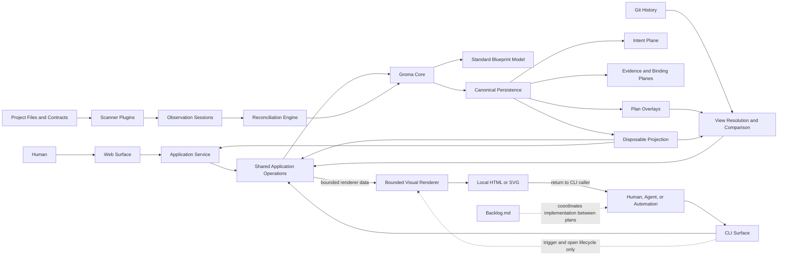
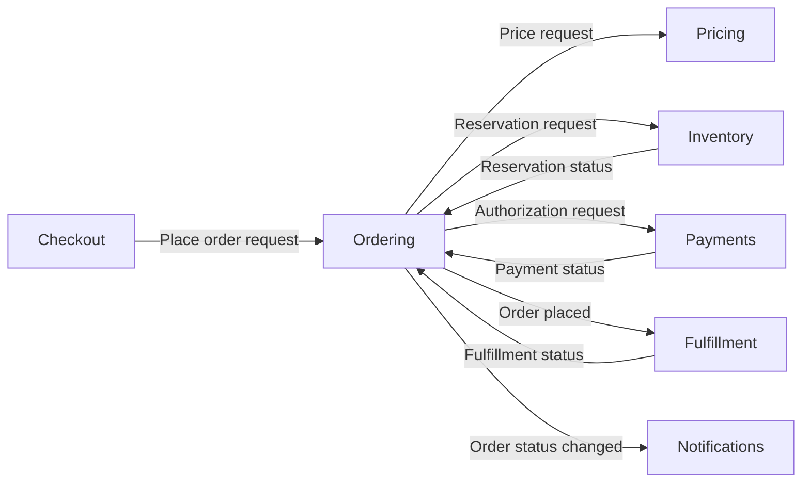
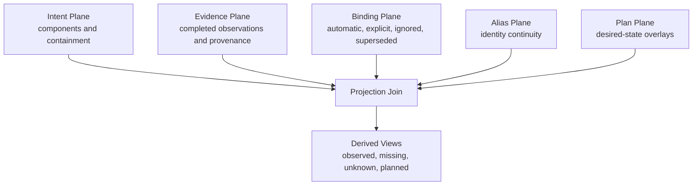

# Groma Architecture Overview

This document is the handmade precursor to Groma's self-blueprint. It describes the
system at the level of intent: what each architectural part is responsible for, what
it receives and produces, and how it relates to the rest of the system.

Until Groma can model itself, this document is the architectural source for bootstrap
work. After the self-blueprint exists under `groma/`, this document remains the human
entry point and the generated blueprint becomes the detailed source of truth.

All decisions in this overview are subordinate to [MANIFESTO.md](MANIFESTO.md).
Brand assets and product presentation follow [brand/README.md](brand/README.md) and
[brand/STYLE.md](brand/STYLE.md). Those documents constrain the renderer without
making presentation state canonical architectural meaning.

## Blueprint Legend

Every component card uses this schema. Optional fields may be omitted when they add no
recognition value:

- **Seed key:** temporary stable handle used by this document. It is not a future
  Groma entity ID.
- **Type:** an open model-owned token describing the component's architectural role.
- **Parent:** the single structural parent component, or `None` for a root.
- **Label:** optional short display label for bounded visual projections.
- **Summary:** optional one-sentence overview used by bounded visual projections.
- **`iconDomain`:** optional canonical favicon-domain recognition metadata; the first
  renderer derives only a deterministic offline domain badge, monogram, or text hint
  from it, and it grants no identity, evidence, network, or trust authority.
- **First delivery:** the first iteration expected to make the component real.
- **Intent:** why the component exists, independent of implementation technology.
- **Inputs:** concepts or information the component receives.
- **Outputs:** concepts or information the component produces.
- **Actions:** responsibilities the component performs.
- **Relationships:** architectural dependencies and collaborations.

The planned delivery iterations are deliberately ordered around useful vertical
slices:

| Iteration | Architectural outcome                                                       |
| --------- | --------------------------------------------------------------------------- |
| 1A        | Correctness walking skeleton and minimal persistence                        |
| 1B        | Minimal query foundation and manual self-blueprint                          |
| 2         | Living visual blueprint: scan, reconcile, inspect, and curate locally       |
| 3         | Plans, Git history, ecosystem hardening, and organization-scale proof       |
| 4         | Long-lived local application service, complete web viewing, and web editing |

## v0.1 Component Vocabulary

The blueprint is a workspace containing one or more root components. Every canonical
architectural entity beneath that workspace uses the same recursively composable
model:

```text
Component
├── name?
├── label?
├── summary?
├── iconDomain?
├── type
├── parent?              # absent for roots
├── intent
├── inputs
├── outputs
├── actions
└── relationships
```

`Component` is the semantic and canonical term. `Node` is a projection term for a
box, chip, folded group, or other item drawn in a particular view. A projected node
does not introduce a second identity system and may summarize more than one canonical
component when the view budget requires folding.

Type is an open token rather than a closed hierarchy. For example, a Shopify blueprint
may have `Shop` and `Users` root components of type `domain`, with recursively nested
components beneath them. A parent may contain children of its own type or any other
type. Each non-root component has exactly one parent; roots have none; containment
cycles are invalid. A component may additionally have any number of ordinary
relationships, including relationships to components in other branches.

`parent` is the Standard Model's single-reference view of structural containment. The
model maps and validates that structure over Core's technology-neutral graph
contracts; Core does not learn component types or hierarchy policy.

`kind` and `type` have different scopes. Graph-level `kind` identifies the entity as a
standard-model `component` and lets codecs reject a document for the wrong entity
kind. Model-level `type` is the open architectural role chosen for that component,
such as `domain`, `service`, `agent`, `store`, or `external`. These are conventional
tokens, not a closed taxonomy. `external` identifies a system outside the blueprint's
ownership that is still architecturally relevant enough to carry intent and
relationships.

`name`, `type`, and `parent` are identity and structural metadata. `label`, `summary`,
and `iconDomain` are optional canonical recognition metadata: `label` is a short
display override for `name`, `summary` is concise intent for overview cards, and
`iconDomain` is a favicon-domain hint. When `iconDomain` is present, the first renderer
derives only a deterministic, self-contained domain badge, monogram, or text hint from
it; it never fetches a favicon or any other remote asset. `iconDomain` never
participates in identity or evidence matching and grants no network or trust
authority. A future explicit icon-resolution capability is separate from the first
renderer and requires explicit user action and a privacy policy. For a projected node
representing one component, display text resolves deterministically from `label`, then
`name`, then the stable canonical component ID when both display strings are absent. The model
intentionally limits structured component meaning to five concepts: intent, inputs,
outputs, actions, and relationships. This is enough to make a component understandable
and connectable without forcing users or scanners to fill in a large architectural
taxonomy. Other useful concepts map onto this vocabulary until real usage justifies
promoting them:

| Richer concept     | v0.1 representation                                      |
| ------------------ | -------------------------------------------------------- |
| State              | Behavioral prose in the component body                   |
| Requirements       | `requires` relationships                                 |
| Guarantees         | Optional guarantees section in the component body        |
| Triggers           | Usually implied by an input and described by its action  |
| Effects            | Outputs, relationships, or action prose                  |
| Failure outcomes   | Architecturally meaningful outputs                       |
| Configuration      | An input when it matters to other components             |
| Commands           | Inputs that request an action                            |
| Events             | Inputs or outputs representing something that happened   |
| Metrics and status | Outputs when another component or operator consumes them |

Inputs and outputs are the v0.1 connection points. A later model may describe them as
typed ports, but v0.1 does not require users to classify flow, protocol, multiplicity,
or control semantics.

Presentation grouping normally follows canonical containment. A projection may also
fold children, tools, ports, or sequential detail into a temporary visual group to
keep its main layer readable. Such grouping is view-local and never changes parentage,
relationships, or canonical files. A folded group receives a deterministic view-local
label derived from its grouping rule and bounded member count; it never receives a
synthetic canonical component ID or identity.

Every scanner contribution is optional and partial. A scanner may observe only a
component candidate, only actions, or only a relationship. It does not fail the
contract by omitting inputs or outputs, and it is never expected to infer intent,
state, guarantees, or business meaning.

## System Context

Groma sits between systems being built and the people or agents reasoning about those
systems.

- Project files and contracts are observed by scanners.
- Scanners send one-way observation sessions to Groma.
- Groma reconciles observations with durable architectural intent.
- A first-run local visual projection makes the reconciled blueprint immediately
  understandable without becoming another source of truth.
- Humans primarily explore the aggregate blueprint through the web interface.
- Humans, agents, and automation use the CLI for complete semantic access.
- Git retains past blueprint states.
- Groma plans describe future desired states.
- Backlog.md coordinates implementation work between those desired states.

Groma does not implement planned changes and does not expose source-code detail as the
architecture itself.

## High-Level Architecture



The dashed CLI-to-renderer edge carries control only. Every renderer input comes from
a bounded Shared Application Operations read, and the disposable artifact returns to
the CLI caller represented by `Actor`; it does not route through the Web Surface or
its Human node.

## Architectural Component Tree

The nine sections below are root components of the Groma blueprint. They have no
parent; their former role as dedicated containers is now expressed by the same
component model used everywhere else.

| Root component                 | Seed key                   | Type     | Parent |
| ------------------------------ | -------------------------- | -------- | ------ |
| Core                           | `core`                     | `domain` | `None` |
| Official Host                  | `official-host`            | `domain` | `None` |
| Standard Blueprint Model       | `standard-blueprint-model` | `domain` | `None` |
| Canonical Persistence          | `canonical-persistence`    | `domain` | `None` |
| Projection                     | `projection`               | `domain` | `None` |
| Scanning and Reconciliation    | `scanning-reconciliation`  | `domain` | `None` |
| Planning and History           | `planning-history`         | `domain` | `None` |
| CLI, Service, and Web Surfaces | `surfaces`                 | `domain` | `None` |
| Plugin Development             | `plugin-development`       | `domain` | `None` |

The table rows and their section introductions are intentionally sparse root component
definitions; the standard model does not require a full card. Every card nested under
a root uses type `component` unless the card explicitly says otherwise. The `Parent`
field is structural containment; the `Relationships` field remains the unrestricted
collaboration graph.

### 1. Core

Core contains technology-neutral contracts and invariants. It does not know about
filesystems, Markdown, Git, SQLite, CLI syntax, scanner processes, or browsers.

#### Graph Kernel

- **Seed key:** `graph-kernel`
- **Type:** `component`
- **Parent:** Core
- **First delivery:** 1A
- **Intent:** Give every architectural concept stable identity and a common graph
  representation without prescribing a storage or surface technology.
- **Inputs:** Entity definitions; relation definitions; identity requests; registered
  model invariants.
- **Outputs:** Stable entities; resolvable relations; identity and alias results;
  invariant diagnostics.
- **Actions:** Mint identities; resolve aliases; validate graph references; expose
  bounded graph primitives.
- **Relationships:** Used by every model and application operation; delegates
  model-specific meaning to the Standard Blueprint Model.

#### Transaction Engine

- **Seed key:** `transaction-engine`
- **Type:** `component`
- **Parent:** Core
- **First delivery:** 1A
- **Intent:** Make semantic graph changes deterministic, conflict-aware, atomic at the
  capability boundary, and observable by projections and surfaces.
- **Inputs:** Proposed mutations; expected content revisions; registered invariants;
  canonical-store capability.
- **Outputs:** Committed graph generation; entity changes; conflict or validation
  diagnostics; typed events.
- **Actions:** Validate mutations; compare revisions; coordinate commits; publish
  generation changes; recover transaction outcomes through provider contracts.
- **Relationships:** Governs all writes from application operations and reconciliation;
  relies on storage providers without knowing their technology.

#### Query and Event Contracts

- **Seed key:** `query-event-contracts`
- **Type:** `component`
- **Parent:** Core
- **First delivery:** 1A
- **Intent:** Provide bounded, generation-aware reads and change notifications that
  work for both short-lived commands and long-lived surfaces.
- **Inputs:** Query definitions; page limits; cursors; committed transaction events.
- **Outputs:** Bounded result pages; opaque continuation cursors; typed graph events;
  cursor-invalid diagnostics.
- **Actions:** Validate query bounds; associate results with generations; route events;
  describe recovery after missed generations.
- **Relationships:** Implemented by projection providers; consumed by CLI, service,
  comparison, and web components.

#### Observation Contract

- **Seed key:** `observation-contract`
- **Type:** `component`
- **Parent:** Core
- **First delivery:** 2
- **Intent:** Define safe finite sessions through which blind scanners report evidence
  without accessing or mutating the existing blueprint.
- **Inputs:** Session metadata; observations; provenance units; heartbeats; completion
  or failure signals.
- **Outputs:** Provisional session events; validated completed snapshots; failure and
  abandonment diagnostics.
- **Actions:** Fence epochs; validate scope and keys; maintain leases; reject
  contradictions; expose completion to reconciliation.
- **Relationships:** Produced by Scanner Runtime; consumed by Reconciliation Engine;
  persisted through the scan journal provider.

#### Plugin Runtime

- **Seed key:** `plugin-runtime`
- **Type:** `component`
- **Parent:** Core
- **First delivery:** 1B
- **Intent:** Compose replaceable capabilities while making dependencies,
  cardinalities, lifecycle, and incompatibilities explicit.
- **Inputs:** Host bootstrap registry; plugin manifests; capability registrations;
  runtime configuration.
- **Outputs:** Resolved capability graph; lifecycle events; startup diagnostics.
- **Actions:** Resolve Phase 0 and Phase 1 plugins; detect cycles and collisions;
  enforce capability cardinality; start, cancel, and stop plugins.
- **Relationships:** Bootstrapped by Official Host; supplies all built-in and optional
  plugins to Core and shared application operations.

### 2. Official Host

The official host is the composition root for the default local distribution. It is
not part of Core.

#### Default Host

- **Seed key:** `default-host`
- **Type:** `component`
- **Parent:** Official Host
- **First delivery:** 1A
- **Intent:** Start Groma in local CLI, service, and initialization contexts without
  embedding default technologies into Core.
- **Inputs:** Process context; Phase 0 registry; discovered workspace configuration;
  cancellation signals.
- **Outputs:** Running plugin graph; selected surface; startup and shutdown results.
- **Actions:** Start Phase 0; detect workspace presence; load Phase 1; dispatch the
  selected surface; coordinate shutdown.
- **Relationships:** Creates Plugin Runtime; supplies bootstrap providers; hosts CLI
  and application service plugins.

#### Bootstrap Configuration

- **Seed key:** `bootstrap-configuration`
- **Type:** `component`
- **Parent:** Official Host
- **First delivery:** 1B
- **Intent:** Discover and load configuration before the runtime plugin graph exists,
  while keeping filesystem and YAML assumptions replaceable.
- **Inputs:** Bootstrap resource context; config-discovery providers; config-parser
  providers.
- **Outputs:** Workspace locator; typed base configuration; requested runtime plugins.
- **Actions:** Search for configuration; report no-workspace state; parse configuration;
  reject ambiguous or incompatible bootstrap providers.
- **Relationships:** Runs in Plugin Runtime Phase 0; official profile uses Local
  Resources and YAML Configuration providers.

#### Plugin Package Manager

- **Seed key:** `plugin-package-manager`
- **Type:** `component`
- **Parent:** Official Host
- **First delivery:** 3, after the minimal built-in capability path and living visual
  blueprint are proven
- **Intent:** Install, select, reproduce, and update distributable plugin packages
  without exposing package-manager technology to Core or modifying observed projects.
- **Inputs:** Package source; user or blueprint scope; package manifest; project trust;
  committed declarations and exact lock entries.
- **Outputs:** Materialized package; enabled plugin entry points; integrity and
  compatibility diagnostics; deterministic lock changes.
- **Actions:** Resolve local path sources; verify trust and exact locked bytes; filter
  package contributions; add, inspect, enable, disable, and remove packages. Remote npm,
  Git, URL acquisition, updates, and synchronization remain later work.
- **Relationships:** Runs in Official Host; supplies plugin entry points to Plugin
  Runtime; uses Local Resource Provider and host-level acquisition capabilities;
  never changes a scanned project's `package.json`, lockfiles, or dependencies.

### 3. Standard Blueprint Model

The official model is a required built-in plugin rather than a Core assumption.

#### Standard Model

- **Seed key:** `standard-model`
- **Type:** `component`
- **Parent:** Standard Blueprint Model
- **First delivery:** 1A
- **Intent:** Express an intentionally small architectural vocabulary through
  recursively nested components, open types, lightweight recognition metadata,
  intent, inputs, outputs, actions, relationships, lifecycle, and desired state.
- **Inputs:** Partial semantic entity mutations; extension metadata; relation-type
  registrations.
- **Outputs:** Validated partial or complete model entities; model-specific views;
  semantic diagnostics.
- **Actions:** Define the minimal entity vocabulary; normalize semantic documents;
  preserve omitted fields; resolve structural parents; derive labels, child views, and
  standard display states.
- **Relationships:** Uses Graph Kernel; consumed explicitly by official CLI, planning,
  reconciliation, and web plugins.

#### Model Invariants

- **Seed key:** `model-invariants`
- **Type:** `component`
- **Parent:** Standard Blueprint Model
- **First delivery:** 1A
- **Intent:** Ensure no application surface or replacement reconciliation strategy can
  violate the standard model's architectural guarantees.
- **Inputs:** Proposed model transaction; prior entities; evidence ownership;
  conceptual-boundary state.
- **Outputs:** Approval or actionable invariant diagnostics.
- **Actions:** Protect scanner-safe fields; enforce single-parent and acyclic
  containment rules; preserve pinned boundaries; reject invalid relations and
  ambiguous identities.
- **Relationships:** Registered with Transaction Engine; shared by CLI, web, plans, and
  reconciliation.

### 4. Canonical Persistence

Canonical persistence is separated into semantic intent, machine evidence, bindings,
aliases, plans, and transaction recovery.

#### Local Resource Provider

- **Seed key:** `local-resource-provider`
- **Type:** `component`
- **Parent:** Canonical Persistence
- **First delivery:** 1A
- **Intent:** Give official storage and configuration plugins portable local resource
  access without exposing filesystem concepts to Core.
- **Inputs:** Resource locators; read, enumerate, lock, and atomic-replace requests.
- **Outputs:** Resource contents; resource metadata; local coordination results.
- **Actions:** Resolve local resources; enumerate bounded paths; coordinate supported
  local locks; perform atomic replacement; detect unsupported coordination contexts.
- **Relationships:** Used by configuration, canonical stores, transaction journal, and
  projection providers.

#### Markdown Intent Store

- **Seed key:** `markdown-intent-store`
- **Type:** `component`
- **Parent:** Canonical Persistence
- **First delivery:** 1A
- **Intent:** Persist human- and agent-curated architectural meaning as deterministic,
  reviewable Markdown without mixing it with scan churn.
- **Inputs:** Components; structural parent references; embedded interface items;
  declared relations; model extensions.
- **Outputs:** Versioned intent documents; content revisions; parsed semantic entities.
- **Actions:** Load and serialize intent; shard by stable identity; preserve unknown
  extensions; diagnose malformed or conflicted documents.
- **Relationships:** Implements canonical-store capabilities; uses Local Resource
  Provider; never receives scanner observations directly.

#### Evidence and Binding Store

- **Seed key:** `evidence-binding-store`
- **Type:** `component`
- **Parent:** Canonical Persistence
- **First delivery:** 2
- **Intent:** Preserve completed observations, provenance, coverage, and Groma-owned
  bindings separately from semantic intent.
- **Inputs:** Completed snapshots; binding decisions; ignored evidence; key migrations;
  project and source identity.
- **Outputs:** Canonical evidence shards; binding records; coverage records; evidence
  generations.
- **Actions:** Commit completed evidence; update provenance; persist automatic and
  explicit bindings; preserve source ownership; exclude volatile timestamps.
- **Relationships:** Written by Reconciliation Engine; read by Projection Index and
  evidence application operations; physically separate from Markdown Intent Store.

#### Alias Store

- **Seed key:** `alias-store`
- **Type:** `component`
- **Parent:** Canonical Persistence
- **First delivery:** 1B
- **Intent:** Preserve continuity when conceptual entities merge or scanner keys
  migrate.
- **Inputs:** Merge transactions; obsolete IDs; surviving IDs; key-translation maps.
- **Outputs:** Canonical alias records; resolution chains; cycle diagnostics.
- **Actions:** Record supersession; resolve old IDs; prevent cycles; expose aliases to
  bindings, relations, plans, and comparisons.
- **Relationships:** Used by Graph Kernel, Reconciliation Engine, Plan Views, and Git
  comparison.

The official local store serializes this plane as deterministic Markdown at
`groma/aliases.md` using schema `groma/aliases/v0.1`. Frontmatter records contain only
`source` and `target` opaque component IDs and are ordered by source. An explicit
component merge removes the obsolete component,
re-homes any outgoing relationships under the unchanged survivor, and publishes the
alias in one canonical transaction. Incoming relationships and child parent references
remain in their owning intent documents and resolve through the alias chain. Ordinary
renames, updates, moves, and reparenting never create aliases. A source that remains live,
multiple targets for one source, self-aliases, cycles, and chains without one live target
all fail closed before canonical publication.

Merge does not rewrite unrelated owning documents. When a component document is newly
created, explicitly reparented, or re-homed by a merge, references accepted through an
obsolete ID are serialized as the current surviving ID. Existing untouched references
remain readable through the same canonical alias resolver.

#### Transaction Journal

- **Seed key:** `transaction-journal`
- **Type:** `component`
- **Parent:** Canonical Persistence
- **First delivery:** 1A
- **Intent:** Ensure local multi-resource changes recover to a complete previous or new
  generation after interruption.
- **Inputs:** Prepared transaction; base generation; target resources; commit progress.
- **Outputs:** Recovery evidence; committed generation marker; rollback or completion
  result.
- **Actions:** Record intent to commit; stage replacements; recover interrupted work;
  coordinate the projection watermark.
- **Relationships:** Supports Transaction Engine and scan completion; uses Local
  Resource Provider; coordinates with Projection Index.

#### Schema Migration

- **Seed key:** `schema-migration`
- **Type:** `component`
- **Parent:** Canonical Persistence
- **First delivery:** 3
- **Intent:** Evolve versioned canonical documents explicitly and reviewably without
  silently changing a workspace during ordinary mutations.
- **Inputs:** Workspace schema floor; document schema versions; registered migrators.
- **Outputs:** Migration preview; migrated documents; mixed-version diagnostics.
- **Actions:** Validate migration path; preview changes; migrate transactionally;
  verify idempotence.
- **Relationships:** Exposed through CLI; applies to every canonical store; validated by
  Groma Check.

Canonical schemas declare an integer document version independently of their schema-token
family. The current intent/configuration token `groma/v0.1`, alias token
`groma/aliases/v0.1`, and package-lock token `groma.packages-lock/v1` are all document
version 1. A workspace floor is the minimum observed document version; mixed state means
that more than one version is present. Schema tokens remain exact and are never compared
lexically or rewritten by ordinary reads.

Migrators are directed, version-increasing edges between exact schema tokens. They arrive
as multiple-provider `groma.schema-migrators/v1` capabilities through the public plugin
SDK. Status selects no code path speculatively: every canonical resource must have exactly
one bounded simple path to the Host target version. No path, more than one path, a newer
incompatible version, path-search exhaustion, a throwing callback, a malformed result, or
nondeterministic output fails closed before journal preparation. Per-document and aggregate
byte budgets bound retained migration results independently of resource count.

The official local catalog covers `groma/groma.yaml`, `groma/packages.lock`,
`groma/aliases.md`, every stable-ID intent shard, and flat plugin-owned records at
`groma/records/<plugin-id>/<record>.{json,md,yaml,yml}`. It reads the three exact root
records and enumerates only the bounded intent and records planes; transaction recovery
state and unrelated files are never migration targets and cannot consume catalog depth or
entry bounds. Status and preview are read-only; preview lists every catalogued resource
and runs each selected transform twice in memory to prove byte determinism. Apply
revalidates the complete resource/revision set and publishes one deterministic
all-resource batch through the existing local transaction journal. A crash therefore
restarts to the complete old or new generation. Prepare re-enumerates the exact catalog,
so additions, removals, partial target sets, and unrelated targets cannot commit.
Migration is never invoked by ordinary reads or semantic mutations.

### 5. Projection

Projection provides disposable performance state. It can be deleted without losing
the blueprint.

#### Projection Index

- **Seed key:** `projection-index`
- **Type:** `component`
- **Parent:** Projection
- **First delivery:** 1B
- **Intent:** Materialize canonical state into a fast local index for search, joins,
  traversal, evidence state, and plan views.
- **Inputs:** Canonical documents; evidence and bindings; aliases; committed generation
  events.
- **Outputs:** Indexed entities; adjacency; search results; derived states; generation
  watermark.
- **Actions:** Rebuild from canonical state; incrementally repair changed files; join
  intent and evidence; materialize plan projections.
- **Relationships:** Implements projection capability for Query Engine; uses canonical
  stores but never becomes authoritative.

The first official provider writes one bounded deterministic JSON cache at
`.groma-cache/projection-index.json`, deliberately outside canonical `groma/` records
and the Host's personal `.groma` user-data root. A provider-owned ignore marker inside
the cache directory keeps its contents invisible to Git without changing project ignore
rules. The cache records its exact graph generation and a separate canonical-content
fingerprint, then contains sorted entities, relationships, canonical aliases,
deterministic searchable text, and incoming/outgoing relationship adjacency. The Core
contract keeps that fingerprint opaque and bounded; the official local provider owns its
lowercase SHA-256 representation. It contains no layout, renderer theme, timestamps, or
filesystem paths.

Rebuild reads one complete canonical transaction snapshot at an exact generation. A
contiguous `graph.committed` event updates its affected entity and relationship
records, refreshes aliases and every alias-resolved containment or relationship endpoint,
and re-derives adjacency. Missing, duplicate, reversed,
absent, corrupt, or stale state triggers deterministic reconstruction rather than
speculative repair across a gap. Projection publication uses its own local coordination
lease and one atomic replacement; it never participates in the canonical transaction or
targets canonical intent and alias resources. If reconstruction or publication cannot be
completed safely, callers receive the stable `projection-index-unavailable` diagnostic.
Deleting the cache can therefore change only query availability and rebuild cost, never
blueprint meaning.

A loader that cannot complete the full read-only adoption fence and encounters one exact
projection-lease contention result retries without an elapsed-time timeout: each iteration
safely checks optional local cancellation, attempts that complete adoption fence again, and
only then attempts coordination. Waits use capped exponential backoff from 20 to 500
milliseconds. A completed publication is adopted without another acquisition; a waiter that
acquires becomes the exclusive repairer and may publish only disposable projection resources
and continuity metadata. Action, release, provider, and mixed-diagnostic failures never
authorize retry. The official Host connects plugin cancellation to this persistence-local
wait without changing Core's projection capability, while direct local callers without
cancellation may wait indefinitely behind permanent exact contention. Cancellation does not
interrupt a publication after the waiter has acquired the lease.

A generation match alone never establishes currency because an ignored cache may survive
a branch or checkout change. Load requires both generation and the exact canonical-content
fingerprint. Incremental publication likewise verifies the complete candidate fingerprint
against the current canonical snapshot and reconstructs on mismatch. Oversized regular
cache files are replaceable corruption rather than permanent provider failure. The Host
publishes one projection-aware transaction engine, so application operations and direct
official-plugin transactions share this same post-commit continuity boundary for both
initial execution and recovery.

The complete JSON remains the reconstructable `groma.projection-index/v1`
materialization boundary, not the query API. The same official plugin publishes its
provider object independently as the bounded `groma.projection-read/v1`
`ProjectionReadCapability`, backed by immutable,
generation-and-fingerprint-namespaced resources under `.groma-cache/projection-reads/`:
bounded entity/search catalog chunks, exact entity and relation records, exact alias
chunks, and bounded incoming/outgoing adjacency chunks. Every immutable resource has a
bounded Merkle inclusion proof whose leaf commits to its logical bundle path and exact
bytes. The manifest carries only the bounded root and resource count, while the tracked
journal authorizes that root for the current generation and fingerprint. Reads verify a
resource proof before decoding or using its JSON; corruption reconstructs the disposable
bundle rather than serving bytes under an unrelated canonical identity. One small
`projection-read-current.json` manifest becomes visible only after every referenced
resource is durable. Publication that stops before that replacement is inert; a manifest
whose journal checkpoint has not advanced is unavailable and is validated/rebuilt rather
than trusted. Old bundles are disposable, and bounded best-effort cleanup can change only
disk use or later rebuild cost. Bundle-root discovery does not descend into the current
bundle and has a separate bound from stale-subtree traversal, so current resources cannot
consume the stale-file budget. Reaching the cleanup entry or locator-character cap still
removes the stale files already collected; reclaiming empty provider namespaces and legacy
directories is deferred to the organization-scale validation in GROM-53.

After a fresh canonical validation, an unchanged complete index may adopt the existing
bundle without rewriting it only when its manifest and the durable journal checkpoint
agree exactly. Missing, oversized, malformed, or semantically mismatched current
manifests are reconstructable disposable state. Persistent provider I/O and checkpoint
I/O failures fail closed without publication, and a warm partial read does not force a
canonical reload.
Missing or corrupt authenticated resources use a distinct forced-publication repair path,
so repair cannot be mistaken for ordinary unchanged-load adoption. Caller page and batch
limits remain independent from the local provider's private chunk size; providers
aggregate internal chunks behind the same Core read contract.

Stable-idle canonical snapshots and checkpoint reads are optimistic persistence-local
reads. A canonical snapshot is accepted only when its adapter load is fenced by two idle
journal observations at the same generation. A checkpoint is accepted only when two idle
observations agree exactly on generation, watermark, fingerprint, integrity root, and
resource count. Neither path may bypass a retained or in-use transaction lease. A warmed
exact-matching complete projection may therefore validate canonical identity, manifest,
checkpoint, and provider-owned ignore hygiene and adopt the existing bundle without
coordination or publication. Any non-idle or changing observation, unavailable state,
missing hygiene, continuity mismatch, or repair requirement falls back to the existing
exclusive settlement, recovery, rebuild, and publication path; projection repair or
publication contention follows the cancellation-aware retry above. Checkpoint recording remains
exclusive. Lease-release uncertainty is contained in the Result
contract and never masks an earlier specific validation or generation diagnostic.
An active prepared or committing writer therefore still makes canonical snapshot and
checkpoint reads fail fast; this delivery permits independent readers of settled state,
not reads through an in-progress writer or recovery.

The tracked transaction journal binds its reserved projection watermark to the exact
bounded projection fingerprint, partial-read integrity root, and resource count. This
four-field checkpoint is
operational continuity metadata, not
canonical architectural meaning. Prepare, rollback, commit, and recovery preserve the
prior checkpoint; only a complete projection publication for the current settled canonical
generation may advance it. Legacy journals without a fingerprint discard the old
watermark as unverified. Canonical transactions therefore invalidate normal projection
reads before post-commit projection work begins, and branch switches cannot authorize an
ignored cache from a different same-generation history. A Host's first projection read
per process performs one complete canonical validation, covering first-open, legacy, and
out-of-band edits made while the Host was closed; subsequent reads use only bounded
projection resources. Concurrent direct mutation of Markdown behind a running Host is not
a supported write path. Host operations update through the transaction boundary, and a
fresh Host detects direct file edits before serving a projection.

#### Query Engine

- **Seed key:** `query-engine`
- **Type:** `component`
- **Parent:** Projection
- **First delivery:** 1B
- **Intent:** Answer bounded architectural questions without loading the complete
  organization graph.
- **Inputs:** Filtered entity queries; search text; traversal requests; graph
  generation; cursor.
- **Outputs:** Deterministically ordered pages; subgraphs; counts; cursor-invalid
  diagnostics.
- **Actions:** Search; filter by project and state; traverse incoming and outgoing
  relations; enforce page and subgraph budgets.
- **Relationships:** Uses Projection Index; serves Application Operations, Graph
  Comparator, and Application Service.

The first engine is a replaceable `groma.graph-query/v2` capability. Its plugin requires
only `groma.projection-read/v1`, never the complete `groma.projection-index/v1`
materialization contract. Core defines only
storage-neutral requests and results: exact entity reads, kind-filtered entity pages,
normalized full-text entity pages, and relationship traversal by incoming, outgoing,
or both directions, optional relation type, and bounded breadth-first depth. The
engine exposes a construction-captured immutable page bound. A caller captures one
generation/fingerprint identity for a logical read and supplies it explicitly to every
data-bearing query; the engine never silently advances that read to a newer identity.
The fingerprint is continuity evidence and does not become public blueprint meaning.
The official Persistence implementation consumes only Core's partial
`ProjectionReadCapability`; it never opens canonical Markdown, requests a complete
projection snapshot, or knows a resource locator. The local file provider and a future
database provider implement the same exact-identity, exact live catalog evidence,
catalog-page, bounded live-entity batch, exact entity-or-alias, and directional-adjacency
reads without leaking their storage technology. Every data-bearing provider read echoes
its exact generation/fingerprint identity, which the engine verifies before exposing a
public generation.

Searchable catalog text is bounded after per-string NFKC normalization and lowercase
folding. The official projection applies that transformation before publication, and the
query engine repeats it at the replaceable-provider boundary. Compatibility expansion
therefore fails before an official manifest or continuity checkpoint becomes visible.

Entity and search results are ordered by stable entity ID. Traversal sorts every
frontier and edge by stable identity, visits each entity for expansion once, and emits
each relationship once, so recursive and cyclic graphs remain finite. Page, catalog scan,
search text, term, depth, visited-entity, emitted-relation, and examined-edge budgets are
explicit; type-filtered nonmatches still consume the examined-edge budget. Continuation
anchors are the last stable entity or relation ID and are interpreted only after Core
validates the opaque cursor envelope. The cursor's canonical query binding includes the
projection's bounded canonical-content fingerprint as well as the graph generation;
same-generation branch changes therefore fail `cursor-query-mismatch`, generation
changes always fail `stale-cursor` even when the fingerprint also changed, and a
recomputed anchor that does not occur exactly once
fails `cursor-anchor-mismatch` rather than silently skipping or restarting.

Core's query contracts and the official engine share exact 2,504-character context and
3,864-character cursor ceilings derived from every public maximum, worst-case JSON
escaping, and percent encoding. The cursor bound charges nine characters when one
literal BMP code unit becomes three encoded UTF-8 triplets. Every accepted search can
therefore be represented in its query context and resumed when a bounded page has more
results.
An embedder may configure a larger Core cursor budget, but the engine checks every emitted
cursor against its own bound and fails the page rather than returning an unresumable cursor.

Entity-page resumption validates one exact live catalog entry against the bounded
predicate, charges that lookup to the request work budget, and then begins provider paging
after the anchor. Selected catalog identities are materialized in one ordered
same-identity batch, not by repeating manifest and catalog validation for every result.

#### Visual Blueprint Renderer

- **Seed key:** `visual-blueprint-renderer`
- **Type:** `component`
- **Parent:** Projection
- **First delivery:** 2
- **Intent:** Turn a bounded reconciled subgraph into an immediately understandable,
  self-contained local visual artifact without adding presentation state to the
  canonical blueprint.
- **Inputs:** Bounded subgraph; containment and ordinary relationships; component
  `name`, `label`, `summary`, `iconDomain`, and type metadata; evidence, binding,
  ambiguity, and coverage states.
- **Outputs:** Deterministic local HTML or SVG; bounded main-layer node set; focus and
  detail views; structured intent and evidence inspector; deterministic offline
  domain badge, monogram, or text hint when `iconDomain` is present.
- **Actions:** Select a readable main layer; lay out nodes deterministically; fold
  subordinate detail without changing canonical structure; expand or focus recursive
  components; trace relationships; distinguish curated intent, automatic candidates,
  bound evidence, ambiguity, missing coverage, containment, and ordinary relations;
  render the approved single white architectural-sheet surface with graphite structure
  and restrained Groma green `#1D9E75`; use recursive technical-drawing containment,
  coordinate and registration notation, and permitted neutral depth; preserve
  accessible non-color state cues;
  derive the offline `iconDomain` hint without fetching favicons or remote assets.
- **Relationships:** Consumes presentation-neutral bounded reads from Shared
  Application Operations; follows the official brand and visual-direction guides;
  produces an artifact opened by CLI Surface; its layout, grouping, zoom, and theme
  are disposable and reconstructable; it makes no network request. Any future
  icon-resolution capability is separate and requires explicit user action and a
  privacy policy.

### 6. Scanning and Reconciliation

Scanning observes projects. Reconciliation is the only part that maps those
observations into Groma identity and canonical evidence.

#### Project Registry

- **Seed key:** `project-registry`
- **Type:** `component`
- **Parent:** Scanning and Reconciliation
- **First delivery:** 2
- **Intent:** Register heterogeneous source roots as scanner, provenance, and watch
  boundaries inside one aggregate blueprint.
- **Inputs:** Project locator; display name; enabled scanner configuration; allowed
  coverage.
- **Outputs:** Stable project registration; scanner execution configuration; project
  filters.
- **Actions:** Add, edit, list, and remove source registrations; resolve scanner
  configuration; preserve evidence when a source is unavailable.
- **Relationships:** Supplies Scanner Runtime; read by status and project-filtered
  queries; does not create separate project blueprints.

#### Scanner Runtime

- **Seed key:** `scanner-runtime`
- **Type:** `component`
- **Parent:** Scanning and Reconciliation
- **First delivery:** 2
- **Intent:** Execute blind scanner plugins as finite, cancellable, scoped observation
  sessions.
- **Inputs:** Project scanner configuration; scope; scanner capability; lease and
  cancellation policy.
- **Outputs:** Observation sessions; progress; failure and abandonment state.
- **Actions:** Start scanners; maintain heartbeats; fence epochs; validate declared
  scope; expose provisional progress; terminate or abandon sessions.
- **Relationships:** Uses Project Registry and Observation Contract; sends completed
  sessions to Reconciliation Engine; never supplies blueprint state to scanners.

#### Reconciliation Engine

- **Seed key:** `reconciliation-engine`
- **Type:** `component`
- **Parent:** Scanning and Reconciliation
- **First delivery:** 2
- **Intent:** Incorporate validated observations while preserving curated meaning,
  source ownership, explicit bindings, and pinned boundaries.
- **Inputs:** Completed observation snapshot; prior evidence; provenance; binding rules;
  aliases; model invariants.
- **Outputs:** Evidence transaction; binding updates; deterministic automatic entities;
  missing-evidence and ambiguity diagnostics.
- **Actions:** Match stable observation keys; apply explicit bindings; create automatic
  candidates; update scoped provenance; identify missing evidence; reject prohibited
  regrouping.
- **Relationships:** Uses Transaction Engine and Standard Model invariants; writes
  Evidence and Binding Store; publishes committed changes to Projection Index.

#### TypeScript and Bun Scanner

- **Seed key:** `typescript-bun-scanner`
- **Type:** `component`
- **Parent:** Scanning and Reconciliation
- **First delivery:** 2
- **Intent:** Provide the first deterministic technology-specific observation source
  and prove that the generic scanner boundary works on Groma itself.
- **Inputs:** Allowed TypeScript project files; package and directory strategies;
  scanner configuration.
- **Outputs:** Any defensible subset of component candidates, public-action candidates,
  high-confidence inputs or outputs, observed import relations, raw documentation
  evidence, and provenance units.
- **Actions:** Discover configured boundaries; inspect public exports; map cross-boundary
  imports; optionally detect Bun routes; emit stable observations.
- **Relationships:** Runs through Scanner Runtime; knows Observation Contract but no
  Groma entities, bindings, component hierarchy, or descriptions; is never required
  to populate a complete component.

#### External Observation Submission

- **Seed key:** `external-observation-submission`
- **Type:** `component`
- **Parent:** Scanning and Reconciliation
- **First delivery:** 3
- **Intent:** Let external agents, humans, and independent scanners report observations
  through the same safe session model without editing canonical files.
- **Inputs:** Versioned framed begin, observation, heartbeat, and complete records from
  a file or standard input.
- **Outputs:** Validated observation session; final submission result.
- **Actions:** Decode transport; enforce session lifecycle; reject incomplete streams;
  pass observations to the standard sink.
- **Relationships:** CLI adapter over Observation Contract; independent of CLI result
  formats; processed by Reconciliation Engine.

### 7. Planning and History

Planning represents desired architecture. History reconstructs prior canonical states.

#### Plan Registry and Overlays

- **Seed key:** `plan-registry-overlays`
- **Type:** `component`
- **Parent:** Planning and History
- **First delivery:** 3
- **Intent:** Let humans and agents describe ordered future architectural states without
  encoding implementation operations.
- **Inputs:** Plan identity and order; sparse overlays for existing entities; complete
  desired documents for new entities; absence tombstones.
- **Outputs:** Versioned plan registry; canonical desired-state overlays; ordering and
  orphan diagnostics.
- **Actions:** Add, edit, order, and remove plans; pre-mint entity IDs; preserve only
  asserted future fields; detect order collisions.
- **Relationships:** Uses Standard Model and canonical plan storage; linked by optional
  metadata to Backlog milestones without depending on Backlog.md.

#### View Resolver

- **Seed key:** `view-resolver`
- **Type:** `component`
- **Parent:** Planning and History
- **First delivery:** 3
- **Intent:** Materialize current, cumulative planned, and historical blueprint views
  through one consistent interface.
- **Inputs:** View selector; current graph generation; ordered overlays; Git revision;
  aliases.
- **Outputs:** Materialized view; view identity; orphan or unavailable-view diagnostics.
- **Actions:** Resolve `current`; overlay through `plan:<id>`; request `rev:<ref>`;
  cache plan materializations; resolve aliases.
- **Relationships:** Uses Projection Index, Plan Registry, and Git Revision Provider;
  supplies Graph Comparator and entity reads.

#### Graph Comparator

- **Seed key:** `graph-comparator`
- **Type:** `component`
- **Parent:** Planning and History
- **First delivery:** 3
- **Intent:** Explain architectural difference between views and determine whether one
  plan's asserted intent has been satisfied.
- **Inputs:** Two materialized views or one plan-scoped assertion set; filters;
  pagination request.
- **Outputs:** Added, changed, absent, and unresolved entities; bounded comparison pages;
  conformance exit status.
- **Actions:** Compare by stable identity; resolve aliases; ignore unasserted plan
  fields; produce deterministic ordering; calculate plan-scoped conformance.
- **Relationships:** Uses Query Engine and View Resolver; exposed by CLI and web through
  shared operations.

#### Git Revision Provider

- **Seed key:** `git-revision-provider`
- **Type:** `component`
- **Parent:** Planning and History
- **First delivery:** 3
- **Intent:** Reconstruct past canonical blueprints from Git without placing Git
  concepts in Core.
- **Inputs:** Git reference; canonical resource request; repository context.
- **Outputs:** Read-only historical canonical view; unavailable or conflicted revision
  diagnostics.
- **Actions:** Resolve revisions; load historical resources; build a temporary view;
  preserve historical identity and aliases.
- **Relationships:** Implements historical view capability for View Resolver; optional
  in non-Git host profiles.

### 8. CLI, Service, and Web Surfaces

Surfaces never write stores directly. They call shared application operations.

#### Shared Application Operations

- **Seed key:** `application-operations`
- **Type:** `component`
- **Parent:** CLI, Service, and Web Surfaces
- **First delivery:** 1A
- **Intent:** Define one semantic path for every supported read and mutation regardless
  of surface.
- **Inputs:** Validated operation request; expected revisions; caller presentation
  preferences.
- **Outputs:** Domain result; bounded component page or traversal subgraph; conflict or
  validation diagnostic; committed transaction result.
- **Actions:** Coordinate queries and mutations; canonicalize projection-backed graph
  results; enforce workspace requirements; call registered invariants; return
  presentation-neutral results.
- **Relationships:** Uses Core, Standard Model, Projection, Query Engine, scanning, and
  planning capabilities; called by CLI and Application Service.

One blueprint export page is a self-contained bounded aggregate ordered by ascending
stable component identity. Each item carries one canonical Standard Model component plus
every outgoing depth-1 Standard relationship from that component. Application pages
those relationships sequentially inside the operation, enforces one generation and one
page-wide relationship bound, and exposes only the query engine's fingerprint-bound
component cursor. Each internal relationship request is bounded by the smaller of the
engine's immutable page bound and the remaining relationship budget, independently of
the caller's component page limit. Application captures one identity before the
component page and reuses it for that page and every internal traversal; a
same-generation branch switch therefore fails closed. Search and traversal keep their
own one-page cursors for independent exploration; neither is a second phase of export.
Traversal order remains breadth-first depth and then stable relationship identity.
Application exact-counts canonical-JSON UTF-8 bytes and proves depth on every final
export, search, and traversal page under the Host-supplied `maxBlueprintPageBytes` and
`maxBlueprintPageDepth` bounds. The descriptor-safe counter never invokes
behavior-bearing values or constructs a second serialized page, and it does not run on
export's internal traversal pages. Proven page-wide relationship, structural-value,
byte, or depth exhaustion returns an operation-specific semantic page-bound diagnostic
so a caller can retry with a smaller limit; malformed, hostile, or unavailable query data
remains an infrastructure failure. A failure at limit one identifies one self-contained
export item, search component, or traversal hit as too large.

The official shared operation surface is published only as `groma.operations/v2`.
Official full-workspace and blueprint registrations require that v2 identity; no v1
operation or graph-query adapters are published. The Host lifecycle recognizes the exact
legacy v1 operations object only as a narrow initialization compatibility shape, captures
only its `initialize` method, and never promotes that object into v2 workspace or
blueprint operations.

#### CLI Surface

- **Seed key:** `cli-surface`
- **Type:** `component`
- **Parent:** CLI, Service, and Web Surfaces
- **First delivery:** 1A
- **Intent:** Provide the complete automation and agent-facing Groma workflow with
  deterministic human-readable results.
- **Inputs:** Command arguments; plaintext or JSON format; standard input for patches or
  observation submission.
- **Outputs:** One complete bounded result page; stable exit status; optional PTY
  presentation and scan progress; local visual artifact location.
- **Actions:** Parse and dispatch commands; render plaintext and JSON; enforce plain
  behavior; host long-running session commands without streaming ordinary results;
  open the current bounded visual blueprint for interactive use after a successful
  first-run scan.
- **Relationships:** Calls Shared Application Operations; contributes `init`, entity,
  scan, visual export, plan, diff, validation, migration, and plugin commands over
  time; uses Visual Blueprint Renderer without adding renderer semantics to
  application operations.

Ordinary command results remain atomic and non-streaming under an eight-MiB rendered
output bound and canonical-JSON depth 30. The official Host gives Application
provider-neutral final blueprint-page bounds 64 KiB below that byte ceiling and two
levels below the depth ceiling, leaving fixed command/result-envelope headroom while
keeping the two layers independent. Proven blueprint-page exhaustion is semantic and
retryable with a smaller limit; the CLI ceilings remain last-resort containment and fail
as `cli-output-bound-exceeded` before any partial result is emitted.

#### Application Service

- **Seed key:** `application-service`
- **Type:** `component`
- **Parent:** CLI, Service, and Web Surfaces
- **First delivery:** 4
- **Intent:** Expose the shared Groma operations and committed graph events to a
  long-lived local web client without creating new semantics.
- **Inputs:** Versioned requests; expected revisions; subscriptions; process lifecycle.
- **Outputs:** Bounded responses; versioned errors; coalesced graph events; generation
  gap signals.
- **Actions:** Serve application operations; enforce request budgets; batch events;
  detect lag; request client resynchronization.
- **Relationships:** Calls Shared Application Operations and Query Engine; hosts Web
  Surface; never writes canonical resources directly.

#### Web Viewer and Editor

- **Seed key:** `web-surface`
- **Type:** `component`
- **Parent:** CLI, Service, and Web Surfaces
- **First delivery:** 4
- **Intent:** Give humans a scalable visual environment for understanding and editing
  the aggregate blueprint.
- **Inputs:** Bounded subgraphs; search and filters; current, plan, and diff views;
  semantic edit requests.
- **Outputs:** Hierarchical visualizations; evidence and intent inspectors; revisioned
  mutations; conflict-resolution prompts.
- **Actions:** Search and expand subgraphs; switch views; inspect provenance; edit through
  application operations; recover from missed generations.
- **Relationships:** Uses Application Service only; does not access Markdown or SQLite;
  replaces the disposable local artifact as the default interactive experience for
  bare `groma` when the long-lived service is available.

### 9. Plugin Development

#### Plugin SDK and Conformance

- **Seed key:** `plugin-sdk-conformance`
- **Type:** `component`
- **Parent:** Plugin Development
- **First delivery:** 1B
- **Intent:** Let built-in and third-party plugins implement capabilities against one
  public contract and verify compatible behavior.
- **Inputs:** Plugin manifest; capability implementations; provider-specific test
  factory.
- **Outputs:** Typed plugin entry points and package manifests; conformance results;
  compatibility diagnostics.
- **Actions:** Define package and plugin manifest helpers; expose public capability
  types; run reusable provider suites; verify lifecycle and cancellation behavior.
- **Relationships:** Mirrors Plugin Runtime contracts; used by every built-in plugin;
  does not expose internal source modules as public APIs.

#### Plugin Scaffolding

- **Seed key:** `plugin-scaffolding`
- **Type:** `component`
- **Parent:** Plugin Development
- **First delivery:** 3
- **Intent:** Create a minimal local plugin skeleton that follows public capability and
  manifest conventions without coupling authors to repository internals.
- **Inputs:** Plugin name; intended capability contributions; local destination.
- **Outputs:** Plugin manifest; entry point; conformance-test starting point.
- **Actions:** Validate plugin identity; generate minimal files; select relevant public
  contracts; avoid unused capability placeholders.
- **Relationships:** Exposed through CLI; uses Plugin SDK; remote discovery and
  marketplace discovery remain outside v0.1.

## Plugin Packages and Installation

Groma uses **packages** as the installation and distribution unit and **plugins** as
the runtime contribution unit. One package may provide multiple plugins, and a
blueprint may enable only the contributions it needs.

### Package Declaration and Checked Manifest

A future npm acquisition flow may declare discovery metadata in its `package.json`:

```json
{
  "name": "@acme/groma-platform",
  "version": "1.4.0",
  "groma": {
    "api": "^1.0.0",
    "plugins": ["./plugins/ownership.js", "./plugins/policy.js", "./plugins/typescript-scanner.js"]
  }
}
```

The nested `groma` record is package-manager metadata. Its `api` range helps a future
acquisition workflow select candidate package releases; it is not the runtime plugin
API token, a canonical Groma package manifest, or permission to execute an entry
point.

The public SDK separately defines the exact checked compatibility envelope:

```json
{
  "apiVersion": "groma.package/v1",
  "name": "@acme/groma-platform",
  "plugins": ["./plugins/ownership.js", "./plugins/policy.js", "./plugins/typescript-scanner.js"],
  "runtimeApiVersion": "groma.plugin/v1",
  "sdkApiVersion": "groma.sdk/v1",
  "version": "1.4.0"
}
```

For the local-path delivery, this exact envelope is the package-root
`groma.package.json`. It is inert static JSON/data that a Host obtains without evaluating a
declared entry point or arbitrary package module. `checkPluginPackageCompatibility()`
reads the six required enumerable data properties and returns a fresh frozen canonical
envelope containing exactly those fields before any package code executes. The official
Host first requires the source JSON document itself to contain exactly these six fields,
with no duplicate or unknown keys. The SDK checker does not
enumerate a package-controlled in-memory object's keys; unknown source properties are
ignored and cannot influence or survive canonicalization. `definePluginPackage()` is
only a build-time TypeScript authoring aid for producing the static envelope; calling
package code is not a discovery mechanism. Each declared plugin path identifies a Phase
1 ES module with one named `plugin` export containing its runtime registration. Importing
that module is the code-execution boundary, never the manifest-discovery mechanism.
Package-manager work must fail closed when
package metadata, this envelope, or an exact lock disagree. Configuration may narrow
the checked entry-point list by enabling selected contributions, but it cannot load an
entry point absent from that list. The official Host owns where it locates, validates
the exact static source-document shape, and locks the envelope; the SDK defines its
compatibility meaning without acquiring packages.

### Sources and Scopes

The initial supported package operations recognize local filesystem paths only:

```text
./local-plugin
/absolute/path/to/local-plugin
```

Blueprint declarations require portable `./` paths contained by the observed workspace.
Personal declarations may use absolute local paths and are canonicalized to their real
local location. Inputs beginning with `npm:`, `git:`, or a URL scheme fail with
`remote-plugin-package-acquisition-out-of-scope` before source filesystem access. The
Host neither resolves a remote registry nor invokes a project package manager.

Packages have two scopes:

- **Personal scope:** workspace-specific enablement stored in the user's Groma data
  root, outside the repository. Only Phase 1 registrations whose provided and required
  capability IDs use `groma.presentation.*` may activate here.
- **Local blueprint scope:** declared in committed Groma configuration and shared by
  everyone working on the blueprint.

Local sources remain read-only live references in this delivery; no source is copied or
installed. Personal declaration and trust state live in the user's Groma data directory.
Neither scope uses or modifies the dependency tree, `package.json`, lockfiles, or
dependencies of an observed project.

Scopes remain explicit on every operation; neither scope silently shadows or enables the
other.

### Reproducibility

Blueprint-affecting plugins include scanners, models, stores, invariants, matchers, and
reconciliation strategies. They are inactive unless declared by the blueprint, even
when their package is installed for the user.

The blueprint commits:

```text
groma/groma.yaml       package declarations and enabled contributions
groma/packages.lock    exact package versions, static-manifest hashes, enabled entry
                       hashes, and resolved plugin IDs
```

Startup reads only declared local paths. Before import it requires the exact static
manifest bytes and every enabled entry module byte to match the deterministic lock. It
then requires an exact trust grant bound to scope, canonical workspace location,
canonical package location, package name, manifest hash, entry path, and entry hash.
Drift fails before module evaluation. Supported package mutations, recovery, and
publication retain one exclusive workspace-scoped package-state coordination lease.
Read-only startup takes that lease briefly to observe canonical configuration, exact lock,
and exact user state as one coherent projection, then releases it before materialization
or import. The same brief fence exact-revalidates all three surfaces after materialization,
immediately before each import, and once more after the final import. The final check also
applies when zero entries are enabled; absent contained user state is attested within the
same coherent fence. A reader follows ordinary brief contention for at most two seconds
per coherent observation, at 25-millisecond intervals, and creates no package-state writes
while waiting; any other coordination failure fails closed as unavailable package state.
Startup may therefore observe only a tuple between writers or follow ordinary contention
until the writer settles; a tuple changed from the initial capture fails closed. Direct
edits are detected by the same revalidation. Read-only startup holds no package-state lease
while plugin bytes are read or evaluated; enablement remains a mutation and retains its
exclusive lease across selected-entry materialization and evaluation. The Host evaluates
the already-read entry bytes through one immutable
in-memory module URL; it never reopens the mutable entry path for execution. Manifest and
entry opens additionally re-check the post-open canonical path, current file identity,
and containment within the previously resolved package root before accepting captured
bytes.

The Host validates unsupported project requests, unavailable official selections,
additional Host registration namespaces, and selected Host registration defects that
local providers cannot satisfy before importing enabled local packages. Package loading
also re-reads canonical configuration before resolving the exact lock, so a selection
changed since bootstrap fails before local module evaluation. Runtime plugin IDs are
unique across the complete enabled blueprint-lock and personal-state union. Enable
evaluates only the newly selected trusted entry, then rejects an ID already reserved by
any other logical package entry before writing trust or package state. The `official.*`
plugin namespace is reserved for Host-owned registrations and is rejected for every local
package entry at the same pre-write boundary. Ordinary startup reads the complete lock
even when configuration has no blueprint declarations, and rejects duplicate stored IDs
before importing either registration. Enable performs the same exact configuration, lock,
and personal-state revalidation immediately before its selected trusted entry executes.

Configuration, lock, and personal-state serialization are preflighted against their
read bounds before publication. Blueprint updates publish the lock before configuration;
if publication is interrupted between those resources, management-only disable and
remove operations recognize the lock-first state and reconcile configuration without
loading package code. The inverse damaged state is also recoverable: when configuration
still enables an entry but the lock or its package record is absent, disable may clear
only that configured selection and remove may then clear the declaration. Recovery does
not inspect the source or execute an entry. Lock and personal-state access failures are
mapped to stable Host diagnostics before crossing the lifecycle boundary.

After a lock replacement commits, any failure replacing configuration or releasing the
coordination lease makes the operation indeterminate, including a definite non-commit of
the second replacement. Recovery compares `groma/groma.yaml` and `groma/packages.lock`,
then uses management-only disable or remove only when the selections differ. Personal
state is verified independently with personal package inspection. Inspection remains
inert when a valid static manifest has changed: it reports `manifest-drift` from the
current bounded manifest without trying to resolve locked entries that the changed
manifest no longer declares. When the manifest remains exact, changed entry bytes
continue to report `entry-drift`.

The runtime's 128-registration ceiling is budgeted before local code can run. The
default profile reserves eleven built-ins and all 64 optional official-runtime slots,
leaving at most 53 enabled local entries across blueprint and personal scopes together;
additional embedder bootstrap registrations reduce that remainder. Configuration
parsing, enable, and ordinary startup enforce the applicable bound before import, and
capacity rejection leaves every persisted byte unchanged.

The initial executable-entry contract is deliberately bounded: one entry is at most 4
MiB, declares at most 16 provided capabilities and 16 required capabilities with the
Host's 128-character token bound, and must be a bundled or otherwise self-contained ES
module. Bun-compatible
TypeScript syntax in that exact file and absolute `node:` built-in imports are supported.
Relative and bare runtime imports are not supported because a data-backed module has no
package-relative resolution base, and pretending otherwise would reintroduce unlocked
mutable-path evaluation.

This boundary is exact-byte execution, not a sandbox. Trusted code still has full user
permissions and may explicitly evaluate other code through absolute URL imports,
computed dynamic imports, filesystem APIs, subprocesses, or other runtime facilities.
Those effects and secondary modules are outside the entry lock. Local path packages
therefore remain live development references rather than remotely reproducible complete
artifacts; a later pinned acquisition model must cover the whole artifact before making
that stronger claim.

### Trust

Groma may read an inert local declaration and exact static manifest without trust.
Immediately before the first import of a new exact entry, the Host requires the explicit
`--trust-full-user-permissions` grant. Persisted trust is stored outside the repository
and bound to both canonical locations and the exact manifest and entry hashes; moving or
changing either invalidates it. Explicitly trusting new exact bytes supersedes obsolete
grants for the same scope, workspace, package identity, and entry. Reverting those bytes
therefore requires explicit trust again instead of reviving an older grant. Persisted
state with more than one grant for a logical subject is ambiguous and fails as malformed
before any import. Disable changes only the enabled selection and deliberately retains
that exact-byte grant; remove is the explicit revocation boundary and prunes the package's
grants after every entry has been disabled.

This delivery attests a persisted trust root only on POSIX, where the Host can require
the real directory to be owned by the current user with mode `0700`. POSIX mode bits do
not attest Windows ACL ownership. Until a bounded Windows owner/ACL capability exists,
the Windows Host never reads or writes persisted plugin trust and never executes an
enabled local plugin. An enabled blueprint package or any existing plugin user-data root
fails with `plugin-package-trust-root-unattested` before entry materialization, import,
or creation of a user-data root. A fresh Windows
workspace with neither condition still starts normally and simply has no personal local
plugins. Removing an inert blueprint declaration may skip trust pruning only when the
Host proves the plugin user-data root is absent; an existing or unclassifiable root keeps
the same fail-closed diagnostic.

Observing the user's home directory makes the default `.groma` path fall inside the
workspace. When that contained root is absent, empty initialization and startup remain
available without creating it. Access that would require persisted trust or personal
package state fails closed before evaluating package code, and existing contained state
is never authorized.

The trust message must explain:

> Plugins run with your full user permissions. Groma verifies what was installed, not
> that it is safe.

Declared capabilities are review information, not a security sandbox. Personal plugins
receive no canonical mutation capability through runtime resolution because both their
provided and required declarations are restricted to `groma.presentation.*`. Trusted
code still has the user's operating-system permissions, as the warning states. This
delivery does not run dependency lifecycle scripts or a project package manager.

### Installation and Enablement

Acquisition, declaration, enablement, and loading remain separate:

```text
local path -> read exact static manifest -> declare scope
           -> select entry -> grant exact trust -> lock entry bytes
           -> re-verify lock and trust -> import -> resolve capabilities -> start
```

Installing a package does not automatically enable every contribution. Removing a
declaration removes Groma's record and exact lock; it never deletes the referenced local
source directory.

Temporary loading and acquisition updates are not part of this delivery.

### CLI Surface

```text
groma package scaffold <destination> --name <package-name> --plugin <plugin-id> --provides <capability-id> [--provides <capability-id> ...]
groma package add <local-path> [--personal]
groma package inspect <package-name> [--personal]
groma package enable <package-name> <entry> [--personal] [--trust-full-user-permissions]
groma package disable <package-name> <entry> [--personal]
groma package remove <package-name> [--personal]
```

Scaffold is the bounded blueprint-package authoring starting point, not acquisition.
Its destination uses the same portable workspace-contained `./` path accepted by
blueprint `package add`, excludes the Host-owned `groma/` state tree, and the success
result returns that reusable path. One invocation
creates one Phase 1 plugin with only the explicitly named single-provider capability
contributions at exact version `1.0.0`. It validates the package, plugin, and capability
identities against the public SDK and Host runtime bounds before writing. The complete
directory is staged beside its destination. Final publication reserves the destination
without replacement and moves the static manifest last, so `package add` never recognizes
an incomplete tree. Invalid or SDK-shadowing package identities, reserved `official.*`
plugin IDs, duplicate or default-Host-conflicting contributions, and existing destinations
fail before publication. Handled write/publication failures remove only an exact-owned
destination; concurrent identity changes are never recursively deleted. Abrupt process
termination may leave a markerless directory that the user must remove before retrying.
The completed scaffold's exact
`groma.package.json`, package metadata, self-contained TypeScript entry, and Bun
conformance test import only `groma/plugin-sdk` or `groma/plugin-sdk/conformance`.

Blueprint scope is the default and writes the declaration and exact lock under `groma/`.
`--personal` writes only outside-repository user state and is presentation-only. Add and
inspect run in a management-only Host composition, so enabled package code is neither
loaded nor started. Enable is the explicit execution boundary and does not enable sibling
entries. This also leaves inspect, disable, and remove available to diagnose or recover
from locked-byte drift. Remove requires every entry to be disabled first.

Remote npm and Git acquisition, complete-artifact integrity, updates, automatic
synchronization, and temporary loading remain later work after the living
visual blueprint's first-run gate.

## Example: Recursive Shopify Blueprint

The original product sketch maps directly to the recursive component model. `Shop`
and `Users` are root components of type `domain`; the Shopify blueprint is their
workspace, not a required parent entity. Every nested box is another component with
one structural parent:

```text
Shop [domain]
├── Cart [component]
├── Orders [component]
│   └── OrderItem [component]
├── Products [component]
└── Shipments [component]

Users [domain]
├── Profile [component]
└── Authentication [component]
    ├── Registration [component]
    └── Login [component]
        └── GoogleLogin [component]
```

This hierarchy may continue to any depth. A component can contain children of its own
type or other types, but a child has only one parent and containment cannot form a
cycle. Actions such as `Add item` and `Remove item` are owned by Cart rather than
modeled as child components. Dependencies or flows between any components—including
components in different roots—use ordinary many-to-many relationships and do not affect
containment.

## Example: Ordering System

This example shows how a complex TypeScript ordering system should appear at the
architectural level. It does not reproduce its packages, classes, handlers, queues, or
storage layout.



The component boundaries express ownership:

- **Ordering** owns the durable order and its business lifecycle.
- **Pricing** owns authoritative purchase prices.
- **Inventory** owns availability and reservations.
- **Payments** owns payment authorization, capture, and refund behavior.
- **Fulfillment** owns delivery of accepted orders.
- **Notifications** owns delivery of customer communications.

The following is an illustrative v0.1 Ordering component nested beneath a Commerce
root component of type `domain`. Its valid opaque IDs are examples, not canonical IDs
for the future Groma self-blueprint. The file lives at
`groma/intent/00/ent_00000000000000000000000000000010.md`.

```md
---
schema: groma/v0.1
id: ent_00000000000000000000000000000010
kind: component
name: Ordering
type: service
parent: ent_00000000000000000000000000000001

desired: present
lifecycle: active

inputs:
  - id: inp_example_place_order
    name: Place order request
    description: >
      A customer's confirmed intent to purchase a priced collection of products.

  - id: inp_example_cancel_order
    name: Cancel order request
    description: >
      A request to cancel an order while its lifecycle still permits it.

  - id: inp_example_fulfillment_status
    name: Fulfillment status
    description: >
      A meaningful change in the progress of fulfilling an order.

  - id: inp_example_payment_status
    name: Payment status
    description: >
      A meaningful change in the payment associated with an order.

outputs:
  - id: out_example_order_placed
    name: Order placed
    description: >
      A durable order accepted for downstream fulfillment.

  - id: out_example_order_rejected
    name: Order rejected
    description: >
      An order that could not be accepted, together with a business reason.

  - id: out_example_order_cancelled
    name: Order cancelled
    description: >
      Confirmation that the order lifecycle reached cancellation.

  - id: out_example_order_status
    name: Order status changed
    description: >
      A customer- or downstream-relevant lifecycle change.

actions:
  - id: act_example_place_order
    name: Place order
    description: >
      Establish a durable order after its price, inventory, and payment conditions
      are satisfied.

  - id: act_example_cancel_order
    name: Cancel order
    description: >
      Cancel an eligible order and coordinate the release of commitments made on
      its behalf.

  - id: act_example_update_progress
    name: Update order progress
    description: >
      Incorporate relevant payment and fulfillment changes into the order lifecycle.

relationships:
  - id: rel_00000000000000000000000000000101
    type: requires
    target: ent_00000000000000000000000000000020
    description: Uses an authoritative price for the purchase.

  - id: rel_00000000000000000000000000000102
    type: requires
    target: ent_00000000000000000000000000000021
    description: Requires products to be reserved before acceptance.

  - id: rel_00000000000000000000000000000103
    type: requires
    target: ent_00000000000000000000000000000022
    description: Requires an acceptable payment state before acceptance.

  - id: rel_00000000000000000000000000000104
    type: informs
    target: ent_00000000000000000000000000000023
    description: Provides accepted orders for fulfillment.

  - id: rel_00000000000000000000000000000105
    type: informs
    target: ent_00000000000000000000000000000024
    description: Provides customer-relevant order lifecycle changes.
---

# Intent

Ordering owns the durable business record of a customer's purchase and its lifecycle
from acceptance through cancellation or completion.

It coordinates the conditions required to place an order, but pricing, inventory,
payment processing, fulfillment, and notification delivery remain separate
responsibilities.

## Behavioral notes

An order progresses through meaningful business states such as pending, placed,
cancelled, and completed. Exact storage, state-machine implementation, event transport,
and API technology are intentionally outside the blueprint.

Order placement must not create two orders when the same purchase intent is submitted
more than once. Cancellation is available only while the order's state and downstream
commitments permit it.

## Guarantees

- Every accepted order has a stable identity.
- The same purchase intent does not create duplicate orders.
- An order is not placed without an authoritative price, inventory reservation, and
  acceptable payment state.
- Meaningful lifecycle changes are available to downstream components.
```

The relationship source is implicit in the owning component file. Everything after
the exact `# Intent` heading and blank line is the component's reversible intent
string; the behavioral notes and guarantees above are therefore prose, not additional
frontmatter schema.

The structured frontmatter remains limited to intent-adjacent identity, inputs,
outputs, actions, and relationships. The richer concepts are represented without
adding mandatory schema:

| Ordering concept                             | Representation                       |
| -------------------------------------------- | ------------------------------------ |
| Order lifecycle state                        | `Behavioral notes` prose             |
| Pricing, inventory, and payment requirements | `requires` relationships             |
| Idempotency and acceptance guarantees        | `Guarantees` prose                   |
| Place-order trigger                          | `Place order request` input          |
| Rejection and cancellation outcomes          | Outputs                              |
| Reservation and payment effects              | Relationship and action descriptions |
| Fulfillment and payment events               | Inputs                               |

A TypeScript scanner might observe only:

```text
component candidate: packages/ordering
actions: placeOrder, cancelOrder, updateFulfillmentStatus
relationships: imports pricing, inventory, payments
```

A framework-specific scanner might additionally observe an HTTP input or an emitted
order event. Neither scanner is expected to infer lifecycle meaning, idempotency,
business guarantees, or the reason these responsibilities form separate components.
Those remain human- or agent-curated intent.

## Canonical Data Planes



- The **intent plane** changes only through semantic human/agent operations.
- The **evidence plane** changes only after a valid scan session completes.
- The **binding plane** records how evidence maps to intent and survives rescans.
- The **alias plane** preserves old identity after merges and migrations.
- The **plan plane** records sparse desired-state assertions.
- Derived status belongs to the disposable projection rather than component files.

## Primary Workflows

### Reach the First Useful Blueprint

```text
groma init
  -> groma scan
  -> complete observation and reconciliation
  -> bounded current-view query
  -> reconstruct local visual artifact
  -> open the main blueprint layer
```

This is the first release-defining product path. It performs no network request or AI
call and uploads nothing by default. The opened main layer uses a presentation budget
rather than a canonical node cap: additional architecture remains available through
component focus, recursive expansion, search, and detail views.

### Initialize a Workspace

```text
host Phase 0
  -> discover no workspace
  -> CLI init operation
  -> create canonical configuration and directories
  -> load Phase 1 plugin graph
  -> validate empty blueprint
```

Initialization is available without an existing workspace. Other semantic commands
fail clearly until initialization completes.

### Create or Edit Intent

```text
CLI or web request
  -> shared application operation
  -> load current content revisions
  -> run model invariants
  -> canonical intent transaction
  -> projection update
  -> committed graph event
```

An edit never writes evidence and never selects an ambiguous entity by guesswork.

### Run a Scan

```text
project registry
  -> scanner runtime starts finite scoped session
  -> scanner emits blind observations
  -> provisional observations enter run journal and status
  -> complete validates the whole session
  -> reconciliation calculates evidence and binding changes
  -> canonical evidence transaction commits
  -> projection publishes one completed generation
```

Failure, contradiction, lease expiry, or abandonment commits no snapshot effects and
never infers absence.

### Reconcile and Bind Evidence

```text
observation key
  -> explicit binding if one exists
  -> ignored rule if one exists
  -> prior automatic binding if one exists
  -> deterministic automatic candidate otherwise
  -> diagnostic when matching remains ambiguous
```

Moving, splitting, merging, or pinning conceptual components changes Groma-owned
bindings. It does not change scanner behavior.

### Navigate the Local Visual Blueprint

```text
bounded current-view query
  -> derive projected nodes from canonical components
  -> choose main layer within the view budget
  -> deterministic hierarchical layout
  -> fold subordinate detail
  -> open local HTML or SVG
  -> focus, expand, trace, or inspect
```

The main layer should be dense enough to communicate the system, but it never truncates
canonical state. Focusing a component replaces the current visual context with a
bounded detail subgraph. Inspection exposes concise intent and structured supporting
evidence, including provenance, bindings, uncertainty, and coverage. Visual groups,
positions, filters, and zoom are disposable.

### Create a Plan

```text
current generation
  + ordered earlier overlays
  + selected sparse desired-state overlay
  -> cumulative plan view
```

Existing entities assert only intended future fields. New entities receive their final
canonical IDs in the plan. Removals assert `desired: absent`.

### Compare and Verify a Plan

```text
plan assertion set
  + current reconciled view
  + alias resolution
  -> plan-scoped differences
  -> exit 0 when asserted desired state is satisfied
```

Unrelated work from another plan does not prevent the selected plan from converging.
If accepted intent changes, the plan changes; Groma does not store discrepancy waivers.

### Load Git History

```text
rev:<ref>
  -> Git revision provider
  -> historical canonical resources
  -> temporary projection
  -> read-only historical view
```

Historical loading is optional and does not place Git semantics in Core.

### Navigate the Web Graph

```text
web query
  -> application service
  -> bounded query or subgraph
  -> hierarchical layout
  -> incremental expansion
```

The browser never requests or lays out the complete organization graph. Missed event
generations cause targeted refetch rather than speculative local repair. It preserves
the same component-to-node, folding, focus, and inspector semantics proven first by
the local visual artifact.

### Self-Hosting with Backlog.md

```text
Groma plan
  -> linked Backlog milestone
  -> focused Backlog tasks
  -> implementation outside Groma
  -> scan and reconcile
  -> groma diff --plan
  -> milestone completes when diff exits 0
```

Backlog.md never becomes a Groma architectural entity store. The two systems share
stable cross-references but retain separate responsibilities.

## Architectural Invariants

1. Scanners never receive existing blueprint state.
2. Scanners never write canonical resources or the projection directly.
3. Failed or incomplete snapshots never infer missing evidence.
4. Semantic intent and scanner evidence occupy separate canonical planes.
5. Missing evidence never deletes curated intent.
6. Stable IDs, not names or paths, define identity.
7. Merged and migrated identities remain resolvable through aliases.
8. All writes pass through shared transaction and invariant capabilities.
9. CLI, service, and web operations have the same semantic results.
10. The projection is disposable and never authoritative.
11. Plans describe desired state, not implementation operations.
12. Git is the past; current canonical state is the present; plans are the future.
13. Backlog.md owns work between iterations, not architecture state.
14. Ordinary CLI results are bounded and non-streaming.
15. Large graphs are explored through search, aggregation, and bounded subgraphs.
16. Unknown plugin metadata survives even when its plugin is unavailable.
17. Ambiguous identity, binding, and relation targets fail closed.
18. Every canonical architectural entity is a component with an open type and zero or
    one structural parent; the blueprint workspace may contain multiple roots.
19. Component containment is acyclic, permits same- or mixed-type recursion, and is
    independent from unrestricted non-containment relationships.
20. The v0.1 component model structures only intent, inputs, outputs, actions, and
    relationships as meaning beyond its small identity, structural, and recognition
    metadata.
21. Scanner observations are partial contributions; no scanner must populate a
    complete component.
22. A visual node is a disposable projection of one or more canonical components, not
    another canonical entity kind.
23. Layout coordinates, folded groups, zoom, focus, theme, and other renderer state
    never enter canonical data.
24. The main visual layer is bounded by a presentation budget; focus, recursive
    expansion, and detail queries reveal additional architecture without imposing a
    canonical component limit.

## Deliberately Unresolved Decisions

These questions remain open until their scheduled iteration provides evidence. They
must not be guessed during earlier implementation.

| Decision                                                     | Earliest evidence                                 | Freeze point       |
| ------------------------------------------------------------ | ------------------------------------------------- | ------------------ |
| Exact standard state taxonomy and display precedence         | Self-scan and drift cases                         | End of Iteration 2 |
| External observation transport grammar                       | Synthetic scanner and agent submission            | End of Iteration 3 |
| Plaintext grammar details                                    | Real agent use across scanning and binding        | End of Iteration 2 |
| Evidence shard fanout beyond the initial 256-bucket strategy | 500,000-observation fixture                       | End of Iteration 3 |
| Default CLI page size                                        | Real query and comparison benchmarks              | End of Iteration 3 |
| Plan ordering UX                                             | Concurrent plan dogfood                           | End of Iteration 3 |
| Event batching thresholds                                    | Viewer and scan load tests                        | End of Iteration 4 |
| Local-artifact main-layer, focus, and expansion budgets      | Iteration 2 local visual prototype                | End of Iteration 2 |
| Browser retained-node budgets                                | Iteration 3 scale evidence and browser load tests | End of Iteration 4 |

The following are explicitly outside v0.1 rather than unresolved:

- hosted coordination and multi-host writes;
- plugin marketplace and sandboxing;
- blueprint federation and importing;
- branching alternative futures;
- plan application or code generation;
- agent approval and permission workflows;
- organization-wide global canvas layout.

## Transition to Groma's Self-Blueprint

When Iteration 1B makes the CLI capable of representing this architecture:

1. Initialize `groma/` in this repository.
2. Create the nine root components listed in the architectural component tree.
3. Create one nested component for each component card using its documented parent.
4. Preserve each `Seed key` as migration metadata.
5. Recreate declared relationships through shared operations.
6. Validate the generated blueprint against this overview.
7. Treat `groma/` as the detailed architectural source of truth.
8. Retain this file as the human-readable system entry point.

Any later disagreement between this overview and the canonical self-blueprint must be
resolved explicitly. The overview must not silently become a second detailed source of
truth.
