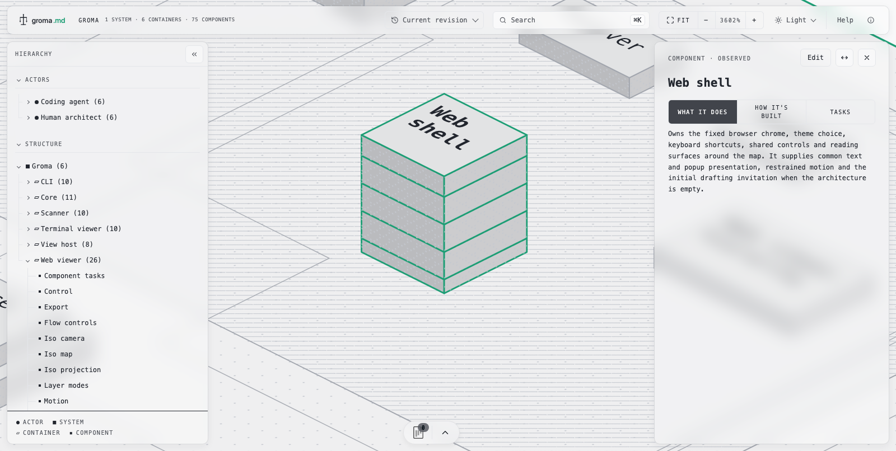
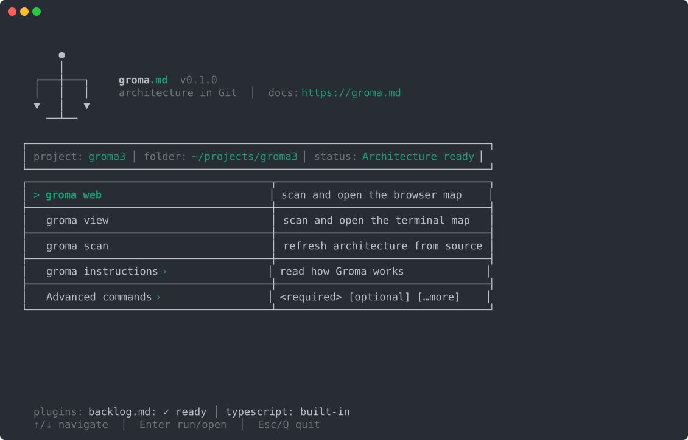
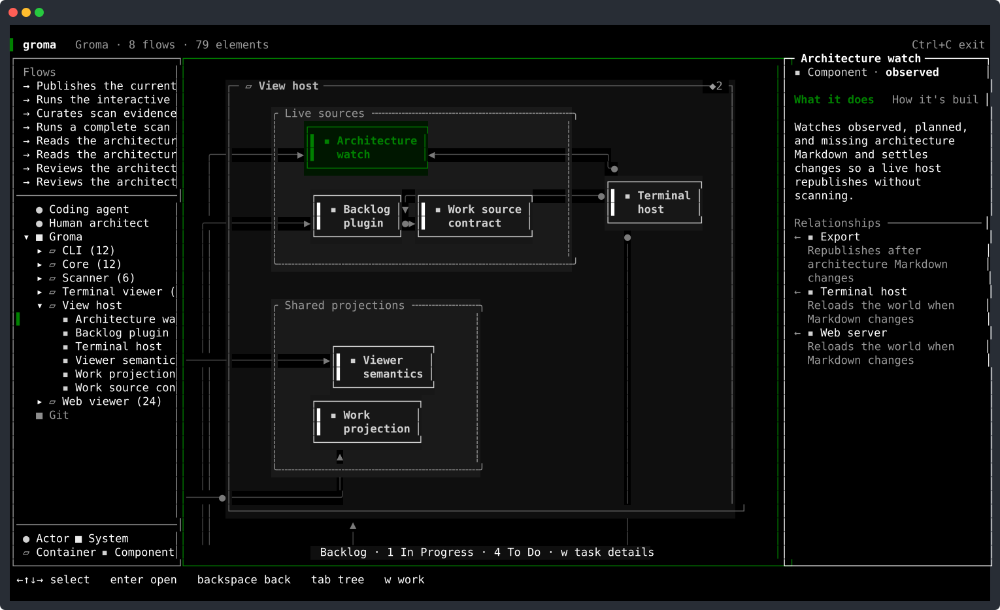

<p align="center">
  <picture>
    <source media="(prefers-color-scheme: dark)" srcset=".github/assets/lockup-dark.svg">
    
  </picture>
</p>

<p align="center">
  <strong>Your software architecture as Markdown in Git, and one C4 map you can walk.</strong><br>
  Solid boxes exist. Ghosts are next.
</p>

<p align="center">
  <a href="https://www.npmjs.com/package/groma.md"></a>
  <a href="LICENSE"></a>
  <a href="https://groma.md"></a>
</p>

<p align="center"><code>npm i -g groma.md</code></p>

<p align="center">
  <picture>
    <source media="(prefers-color-scheme: dark)" srcset=".github/assets/web-dark.gif">
    <source media="(prefers-color-scheme: light)" srcset=".github/assets/web-light.gif">
    
  </picture>
</p>

Groma scans your repository, writes its architecture as one Markdown file per element under `groma/`, and draws that folder as an isometric map in the browser or a map in the terminal. You and your coding agents fix the meaning through a small CLI. The files stay in Git, next to the code, so the architecture ages with the code instead of in a wiki.

## Why

- **Diagrams rot. Files in Git do not.** Every element is a Markdown file. Every change is a diff, a blame, and a pull request review.
- **The scanner finds evidence. People write meaning.** `groma scan` reads TypeScript and C# and attaches the exact source files behind each component. Later scans refresh only those code references. They never rewrite prose you wrote.
- **Works without AI.** The scanner and the authoring commands are a plain CLI. An agent can run the same commands, but nothing in Groma requires one.
- **Nothing to lock you in.** The folder is an [Open Knowledge Format](docs/component-markdown.md) 0.2 bundle. Uninstall Groma and you keep a readable `groma/` that renders on GitHub as it is.
- **Local by design.** No server, no account, no telemetry. `groma web` serves only your machine. `groma export` writes a static site when you decide to share.
- **Drafts live on the same map.** A drafted part is a dashed ghost beside what exists, at the path it will keep. `groma accept` turns it solid only after a scan has found the code.

## Quick start

```sh
npm i -g groma.md      # or: bun add -g groma.md
cd your-repo
groma init
groma web
```

`groma init` asks for a project name, creates `groma/`, and adds a short block to your `AGENTS.md` or `CLAUDE.md` so coding agents know Groma is here. `groma web` scans the repository, writes the first architecture, and opens the map at `http://localhost:4747`. While it runs, saved source files and Markdown changes update the map without a reload.

Prefer the terminal? Run bare `groma` for the launcher, or `groma view` for the terminal map.

<p align="center">
  
</p>

## What a record looks like

One component, one file, written by Groma at `groma/systems/shop/containers/commerce-api/components/ordering.md`:

```markdown
---
type: C4 Component
title: Ordering
description: Order lifecycle coordinator
status: stable
groma:
  id: ordering
  parent: commerce-api
  code:
    - scanner: typescript
      file: packages/orders/src/orders-service.ts
      symbol: OrdersService
---

Owns the lifecycle of an order from placement through completion.

## Technology

TypeScript, NestJS, and PostgreSQL.

## Relationships

| Target | Description | Technology |
| --- | --- | --- |
| [Payments](../payments.md) | Requests payment authorization | Internal API |
```

The frontmatter carries identity, containment, and scanner evidence. The body is yours. The relationship table is the only source of arrows on the map. Delete Groma tomorrow and this file still explains the component.

## How it works

```text
source code ──scan──▶ groma/**/*.md ──view──▶ browser map · terminal map
                            ▲
              add · draft · edit · remove · accept
```

Groma follows the [C4 model](https://c4model.com): actors and systems, the containers inside a system, the components inside a container. Code is evidence attached to components, not a fourth level.

The first scan produces file-shaped components. That is deliberate. You then fold files that share one responsibility into one component, group siblings by domain, and name the collaborations:

```sh
groma edit ordering --combine order-repository order-events   # one responsibility, several files
groma add group "Checkout" ordering payments                  # a named domain on the map
groma add relation ordering payments --description "Requests payment authorization" --technology "Internal API"
groma edit ordering --overview "Owns the lifecycle of an order from placement through completion."
```

Every command validates the whole change before writing. Scans that run afterwards keep your curation. Scanners are plugins. TypeScript is built in. The C# scanner in this repository is enabled with `groma scanner add` and needs a .NET 10 SDK. The [scanner contract](docs/scanners/creating-a-plugin.md) is small enough to add your own language.

### Built on OKF and C4

Groma uses [Open Knowledge Format (OKF) 0.2](https://github.com/GoogleCloudPlatform/open-knowledge-format/blob/main/SPEC.md)
to keep architectural knowledge readable and portable, and [C4](https://c4model.com) to organize architecture into clear
levels and boundaries. Groma's [application profile](docs/component-markdown.md) connects the two: standard Markdown
carries the knowledge, while Groma defines how to interpret it as architecture.

Not every knowledge document is an architecture element. A document can explain the architecture without becoming
another box or containment level on the map.

## Two viewers, one world

The browser map is one isometric blueprint drawn as SVG. Systems are islands, containers are slabs, components are buildings whose size follows the code behind them, and every authored relationship is one route. Click anything for what it does and how it is built, down to the exact file and symbol. Light, dark, and blueprint themes. Every view has a URL.

The terminal map shows the same world in fixed chrome: hierarchy, map, and details. Arrow keys move between neighbours, Enter opens a container, Backspace goes back up.

<p align="center">
  
</p>

The browser map also walks Git history. Its revision menu lists every commit that touched `groma/` and opens the architecture exactly as it was at that commit.

## Working with coding agents

`groma init` adds this to `AGENTS.md` or `CLAUDE.md`:

```markdown
## Groma

This project uses Groma. Run `groma agent-instructions` before planning or changing code. Do not edit Groma-owned architecture files directly.
```

Agents use the same CLI you do. `groma agent-instructions` prints the curation guide, `--help` on any command is the schema, output is plain text, and errors say what to fix. There is no MCP server to run and no JSON to parse. An agent that curates a fresh scan into recognisable components is the workflow Groma was built for, and the human reviews the result on the map.

## Working without coding agents

Everything above is a command you can type. `groma add` declares what no scan can see: a person, an outside system, or a draft. `groma draft` describes a part that does not exist yet as a ghost. `groma edit` changes meaning, folds evidence, and tags a part with the draft that touches it. `groma add relation` writes a collaboration between two parts, and `edit relation` rewords it. `groma remove` takes any of those away again. `groma accept` confirms a ghost once a scan has found its code.

## Live work from Backlog.md

If [Backlog.md](https://github.com/MrLesk/Backlog.md) is installed, both viewers pin its tasks onto the architecture they touch. A task's modified files map to the components that own them, so a pin stands on the building that a teammate or agent is changing right now. Open a pin for the task's description, acceptance criteria, and diff. Groma never writes a task.

## Publish a snapshot

```sh
groma export ./site
```

writes the browser map as a static site with the architecture, flows, source inspection, and mapped tasks. It has no server and no editor. Everything in that folder is public data once you host it, so check what is inside before you push it anywhere.

## Commands

| Command | What it does |
| --- | --- |
| `groma` | Launcher for this repository |
| `groma init [name]` | Create `groma/` and register the repository for agents |
| `groma web` | Scan, then open the browser map |
| `groma view [id]` | Scan, then open the terminal map, or print one record as text |
| `groma scan [--watch]` | Scan and fold findings into Markdown |
| `groma add <thing> <name>` | Declare a person, an external system, a draft, a relation between two ids, or a group of sibling components |
| `groma draft <kind> <name>` | Draft a system, container, or component as a ghost |
| `groma edit <id>` | Rename, describe, set technology, combine, move, group, or tag with a draft; `edit project` for the project record |
| `groma remove <id>` | Remove a person, an external, a ghost, an empty draft, a relation, or a group |
| `groma accept <id>` | Accept a ghost once a scan has matched it |
| `groma export <dir>` | Write a read-only static site |
| `groma scanner …` | Add, list, install, or remove scanner plugins |
| `groma instructions` | Human guides. `groma agent-instructions` prints the agent guide |

Every command documents its required and optional parameters under `--help`.

## Status

Groma is early. What is true today:

- Scanners exist for TypeScript (built in) and C# (a module you enable). Other languages need a [plugin](docs/scanners/creating-a-plugin.md).
- The browser adds, removes, renames, describes, relates, groups and combines through the same verbs as the CLI.
- The terminal map runs on macOS, Linux, and Windows terminals.
- The Markdown contract is strict on Groma's own fields and preserves anything else you put in a file.

If something in the first scan looks wrong, that is the curation step, not a bug. If a command does something surprising, that is a bug. Please open an issue.

## Learn more

- [Documentation index](docs/index.md)
- [Product model](docs/product-model.md), the exact rules for identity, drafts, scans, and the one world
- [Architecture Markdown contract](docs/component-markdown.md)
- [Browser map](docs/viewers/web/index.md) and [terminal map](docs/viewers/tui/index.md)
- [The Groma manifesto](MANIFESTO.md)

## The name

A groma was the Roman surveyor's cross-staff, the instrument that transferred a plan onto the ground. Every Roman road, camp, and city was laid out behind one. The people who used it were the gromatici.

## Contributing

```sh
bun install
bun run check
```

`bun run check` lints, typechecks, and runs both test suites. See [CONTRIBUTING.md](CONTRIBUTING.md) for the workflow.

## License

[MIT](LICENSE)
