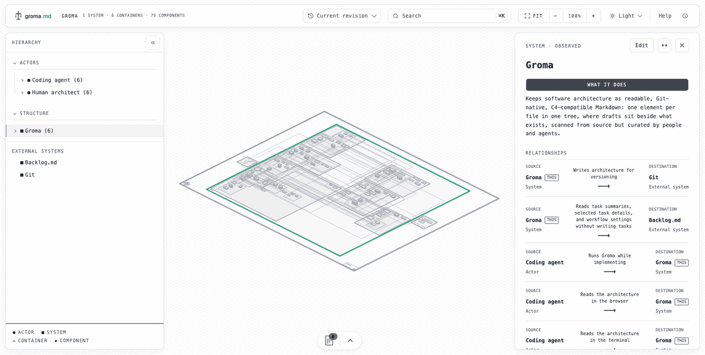
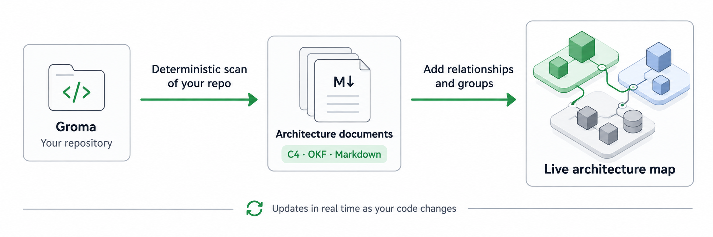
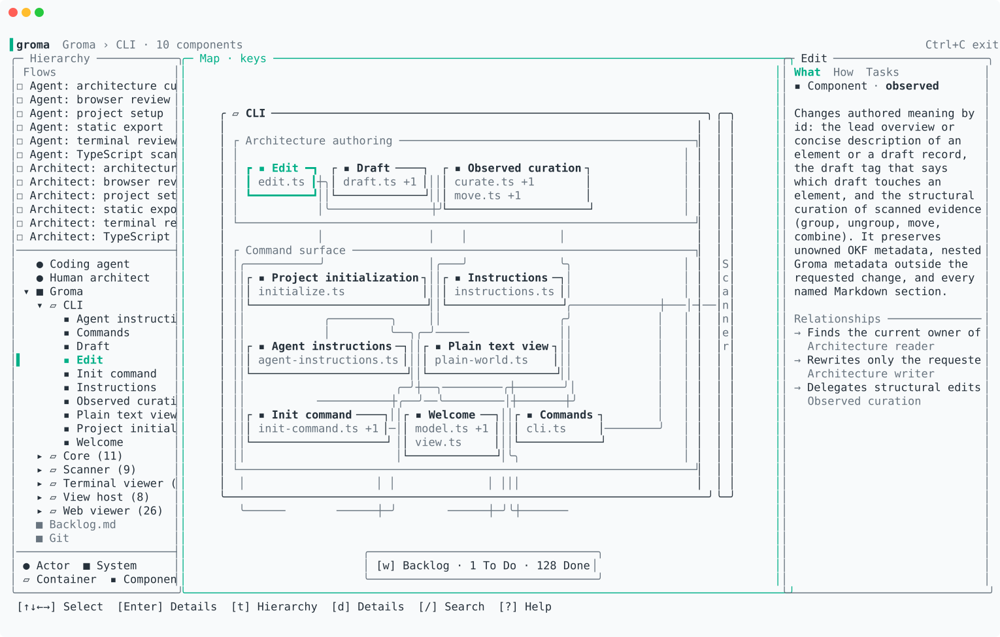

<p align="center">
  <picture>
    <source media="(prefers-color-scheme: dark)" srcset=".github/assets/lockup-dark.svg">
    <source media="(prefers-color-scheme: light)" srcset=".github/assets/lockup.svg">
    
  </picture>
</p>

<p align="center">
  <strong>Your architecture, alive.</strong><br>
  A live C4 map of your repository, stored as OKF Markdown in Git.
</p>

<p align="center">
  <a href="https://www.npmjs.com/package/groma.md"></a>
  <a href="LICENSE"></a>
  <a href="https://groma.md"></a>
</p>

<p align="center">
  <picture>
    <source media="(prefers-color-scheme: dark)" type="image/avif" srcset=".github/assets/web-dark.avif">
    <source media="(prefers-color-scheme: dark)" type="image/webp" srcset=".github/assets/web-dark.webp">
    <source media="(prefers-color-scheme: dark)" type="image/gif" srcset=".github/assets/web-dark.gif">
    <source media="(prefers-color-scheme: light)" type="image/avif" srcset=".github/assets/web-light.avif">
    <source media="(prefers-color-scheme: light)" type="image/webp" srcset=".github/assets/web-light.webp">
    <source media="(prefers-color-scheme: light)" type="image/gif" srcset=".github/assets/web-light.gif">
    
  </picture>
</p>

Groma scans your code, draws it as a [C4](https://c4model.com) architecture map, and keeps that map open while you and your coding agents work. Save a file and the map updates. Work on a [Backlog.md](https://github.com/MrLesk/Backlog.md) task and it appears pinned to the components it touches. Everything is plain Markdown in your repository, so architecture changes are reviewed in the same pull request as the code.

Free, MIT-licensed, and local. No account, backend, or AI service required.

<p align="center">
  <picture>
    <source media="(prefers-color-scheme: dark)" srcset=".github/assets/workflow-dark.png">
    <source media="(prefers-color-scheme: light)" srcset=".github/assets/workflow-light.png">
    
  </picture>
</p>

## Install

```sh
npm i -g groma.md backlog.md
cd your-repo
groma init
```

`groma init` sets up the repository and offers a first scan. Then open the map:

```sh
groma web     # browser map on http://localhost:4747
groma view    # terminal map
```

Backlog.md provides the tasks shown on the map; Groma works without it. macOS requires Apple Silicon.

## Use it with your agent

The first scan gives you components and detected relationships. Your coding agent turns them into architecture: it reads the code, names responsibilities, merges records that belong together, and adds the relationships the scanner cannot see. Always do this after the first scan.

Agents use the same CLI as people. `groma init` registers Groma in your `AGENTS.md` or `CLAUDE.md`, `groma agent-instructions` prints the curation guide, and every command explains itself through `--help`. Ask your agent:

```text
Read the current Groma architecture with `groma agent-instructions` and `groma view --plain`. Compare it with the source code, then annotate the architecture so it reflects the code: combine records that share a responsibility, add missing overviews and relationships, and keep Backlog.md task links current. Use Groma's CLI for architecture changes, then summarize what you changed.
```

Any file resolves to the architecture that owns it, so an agent can start from the code it just changed:

```sh
groma view src/orders.ts    # the architecture record that owns this file
```

Later scans keep what your agent wrote. [Curation guide](docs/agent-instructions/index.md)

## What you get

- **A browser map you can walk.** Zoom from systems to containers to components. Select anything to read what it does and open the source behind it. [Browser guide](docs/viewers/web/index.md)
- **A terminal map** with the same architecture, scanning and watching from your shell. [Terminal guide](docs/viewers/tui/index.md)
- **Live updates.** Saving code refreshes source evidence and detected relationships; new files become new components.
- **Relationships and flows.** Describe how components interact, then chain relationships into named flows readers can step through. [Relationships and flows](docs/component-markdown.md)
- **Drafts.** Sketch systems, containers, and components before they exist. They appear dashed beside the real ones until a scan matches their code and you accept them. [Draft lifecycle](docs/product-model.md#drafts)
- **See work across the architecture.** Backlog.md tasks pin where people and agents are working; select one to highlight the components it touches and inspect its changes without leaving the map. [Task links](docs/agent-instructions/index.md#backlog-task-links)
- **Explore past architecture with its code.** Open an earlier revision and inspect the source from that same commit, down to functions and methods.
- **Publish an interactive site.** `groma export ./site` writes a standalone map with flows, tasks, diffs, and source; `--watch` regenerates it as the repository changes. [Static publication](docs/viewers/web/index.md#static-publication)

<p align="center">
  <picture>
    <source media="(prefers-color-scheme: dark)" srcset=".github/assets/terminal-map-dark.svg">
    <source media="(prefers-color-scheme: light)" srcset=".github/assets/terminal-map-light.svg">
    
  </picture>
</p>

## Plain Markdown, C4, OKF

The architecture lives in a `groma/` folder as an [Open Knowledge Format 0.2](https://github.com/GoogleCloudPlatform/open-knowledge-format/blob/main/SPEC.md) bundle: one Markdown document per element, plus records for relationships, flows, and drafts. C4 gives the structure, OKF keeps it portable, and the documents stay readable without Groma. [Architecture Markdown contract](docs/component-markdown.md)

## Languages

| Language or framework | Status |
| --- | --- |
| TypeScript | ✅ Available |
| C#/.NET | ⏳ Coming soon |
| Java | ⏳ Coming soon |
| Your favorite language or framework | [Submit an issue with your request](https://github.com/MrLesk/Groma.md/issues) |

More languages arrive as [scanner plugins](docs/scanners/creating-a-plugin.md); add your own with `groma scanner add`. See [TypeScript support](docs/scanners/typescript/index.md) for what the scanner reads and [which relationships it detects](docs/relationship-inference.md#current-inference-rule).

## Experimental

Groma is an early prototype. Review the first scan before treating it as your architecture, expect rough edges, and check exports before sharing them, since they can include source code and task details. Report problems in [Issues](https://github.com/MrLesk/Groma.md/issues).

## Documentation and contributing

- [Documentation index](docs/index.md)
- [Product model](docs/product-model.md)
- [Contributing guide](CONTRIBUTING.md)
- [Groma manifesto](MANIFESTO.md)

## License

Groma is free and open source under the [MIT license](LICENSE).
