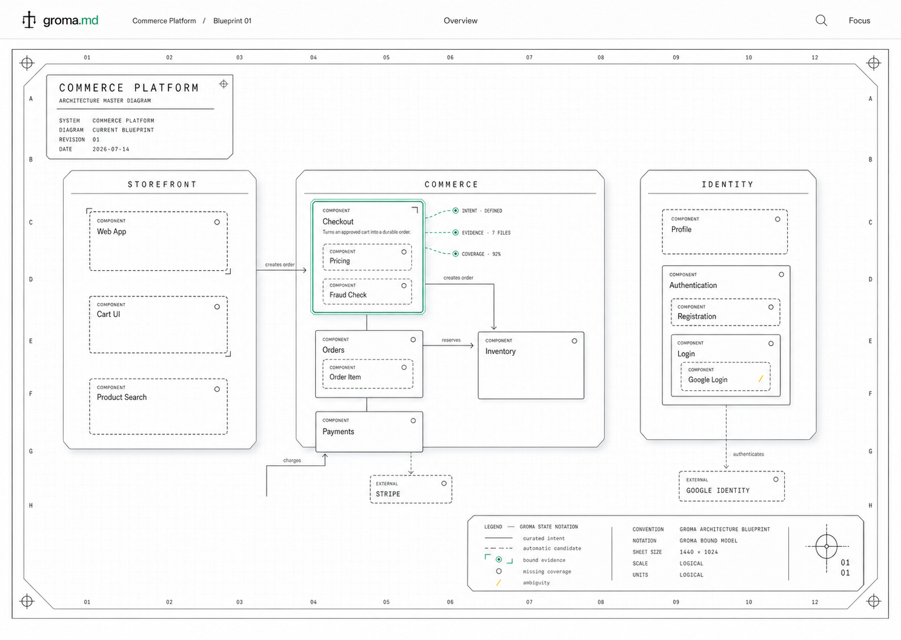

# Groma Product Visual Direction

This guide records the approved direction for Groma's first visual blueprint. Read it
together with [README.md](README.md): the README is authoritative for identity and
asset use; this file is authoritative for the product surface and visual mood.

The first renderer has one deliberate theme. It is not a generic theming system.

## Selected Direction

Groma should feel like a beautifully printed modern architectural master drawing that
happens to be interactive. The blueprint is the product surface. It should be luminous,
precise, content-rich, calm, and immediately readable—not a dashboard placed around a
diagram.

The image is a non-normative composition reference. It captures the selected mood,
density, hierarchy, and depth; the written rules below and the canonical SVG assets
remain authoritative when details disagree or generated text is imperfect.

## Palette

- Use a white or subtly warm-white background.
- Use black, near-black graphite, and cool neutral gray for structural linework and
  text.
- Use the exact Groma green, `#1D9E75`, as the single product accent.
- Reserve green for the surveyed point—active selection, binding, focus, or the
  sightline between intent and evidence—and for the canonical lockup's `.md` suffix
  described under Local Identity Interpretation. Do not wash whole surfaces in green.
- Semantic warnings may use a restrained amber only when paired with a non-color cue.
  Amber is state communication, not a second brand accent.
- Do not use blueprint blue as the product accent in the first renderer.

## Composition

- Let the blueprint consume almost the entire viewport. Keep application chrome thin
  and quiet.
- Present the bounded main layer as a technical sheet: a fine grid, coordinate frame,
  registration marks, drawing title block, recursive domain plates, relationship
  leaders, and a compact notation or specification block.
- Make containment the dominant geometry. Root domains are large architectural plates;
  components and deeper children are precise nested boundaries inside them.
- Use line weight, spacing, and typography to express hierarchy before adding fills or
  decoration.
- Keep the main layer dense enough to explain the system. Focus views reuse the same
  drawing language to reveal deeper recursive detail.
- Use orthogonal or deliberately routed relationships with short labels. Containment
  and ordinary relationships must remain visually distinct.

## Depth

- Root domain plates may use a soft, broad, low-opacity neutral shadow to separate
  them from the drafting surface.
- A selected component may use one restrained elevation shadow and a precise double
  outline.
- Nested components should usually remain flat, transparent, and line-based.
- Bound evidence may appear as a fine green line offset behind the canonical boundary,
  like tracing paper or a surveyed overlay.
- Never add shadows, gradients, distortion, or 3D treatment to the official brand
  marks or lockup.

## Brand Use

- Use the lowercase `groma.md` lockup on full product surfaces. Never render the
  product wordmark as title-case `Groma`.
- Use [mark-frontal.svg](mark-frontal.svg) at small sizes, following the reduction and
  clear-space rules in [README.md](README.md).
- Use [mark-topdown.svg](mark-topdown.svg) sparingly as a registration, survey-point,
  loading, or watermark motif.
- Use [mark-sightline.svg](mark-sightline.svg) only where a sightline or surveyed-point
  concept is meaningful. Do not turn it into generic decoration.
- Prefer DIN-derived engineering faces such as DIN, Overpass, or Archivo. A neutral
  system sans is an acceptable implementation fallback.

## Local Identity Interpretation

Read these repository-specific clarifications together with the byte-exact canonical
[README.md](README.md) and official SVGs. They resolve how the shipped package is used
locally; they do not replace the canonical rules or authorize new assets.

- **Accent exception.** The canonical lockup's green `.md` is the explicit wordmark
  exception to the shorthand that only the sightline and surveyed point receive the
  accent. Within glyphs, only the sightline and surveyed point are green. In the full
  lockup, `.md` is also green exactly as shipped. Do not recolor `groma` or any
  structural stroke.
- **Small identity marks versus auxiliary motifs.** The canonical rule that sizes at
  or below 64 px use the frontal mark applies to identity, avatar, favicon, and app-icon
  use. The top-down and sightline assets are auxiliary survey, loading, registration,
  and hero motifs, not replacement small identity marks. They may appear below 64 px
  only when that specific non-identity context preserves their stroke legibility.
  Preview the motif at its intended pixel size, at normal 100% viewing scale, on its
  final background: every crossbar, plumb line, sightline, and surveyed point that is
  present must remain distinct without zooming. If any stroke merges or disappears,
  or if the motif could be read as the product identity, use the frontal mark.
- **Illustrated hero availability.** The illustrated hero described by the canonical
  README is not included as an asset in this repository or in the selected blueprint
  reference PNG. Do not invent it, extract it from the reference, or treat it as an
  available asset; obtain it through the canonical brand-source workflow if it is
  supplied later.
- **Dark variants.** The committed dark SVGs are pre-generated outputs from the
  upstream canonical brand package. Groma stores no generator command for them.
  Consumers use the shipped variants as-is; geometry or color changes belong in the
  canonical source workflow and return here only as verified byte-exact imports.

## Visual Semantics

The renderer must not rely on color alone:

| Meaning             | Primary notation                                      |
| ------------------- | ----------------------------------------------------- |
| Curated intent      | Solid graphite boundary                               |
| Automatic candidate | Exact short-dashed graphite boundary                  |
| Bound evidence      | Paired green corner line and surveyed-point mark      |
| Missing coverage    | Open graphite circle                                  |
| Ambiguity           | Short amber diagonal plus explicit text when selected |
| Selected focus      | Graphite double outline with one green active rule    |
| Containment         | Nested architectural boundary                         |
| Relationship        | Labeled routed line with a directional terminus       |

Selection, evidence, ambiguity, and coverage details belong in structured inspection.
They should not turn every component into a dashboard card.

## First Renderer Constraint

The first bounded local renderer ships this single white theme. It has no light/dark
switch and no general theme system. A different theme requires a later explicit
product decision. Theme, layout, focus, folding, and coordinates remain disposable
projection state and never enter the canonical blueprint.

## Avoid

- blue as the brand or selection accent;
- dark mode or a theme switch in the first renderer;
- title-case `Groma` as the product wordmark;
- cartoon, hand-drawn, sketch-marker, or bubbly visual language;
- dashboard chrome, metric cards, floating inspectors, and icons in every component;
- heavy shadows, gradients, glassmorphism, neon, or decorative 3D;
- excessive rounded cards, pills, badges, or color-coded surfaces;
- literal floor-plan furniture, hardware schematics, or vintage patent distress;
- persisting renderer choices as architectural meaning.
