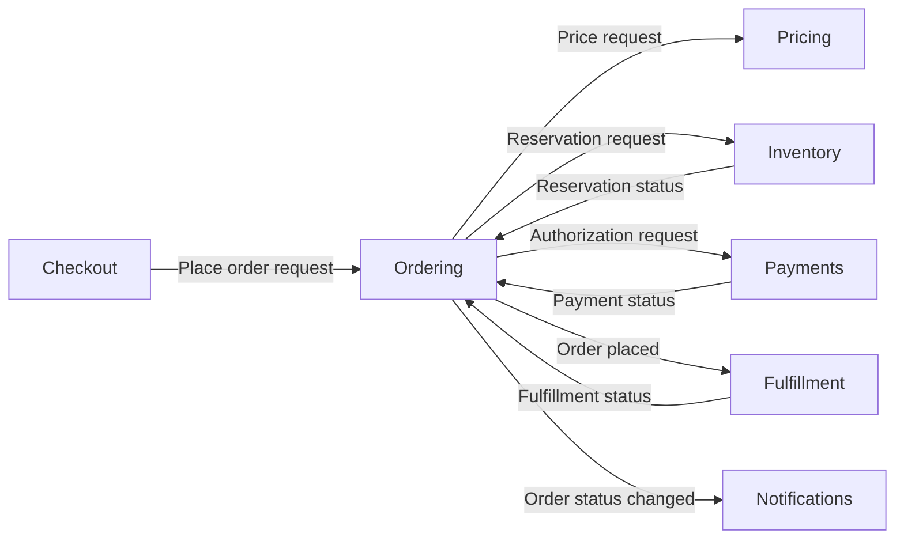

# Component Model Teaching Examples

These are teaching examples, and they are **noncanonical**: they are not part of Groma's
self-blueprint, they do not define product behavior, and they do not replace the canonical
component model under [`../groma/`](../groma/). Every `ent_`, item, and `rel_` ID below is
made up for illustration and must never be reused. Real canonical state is created through
supported public Groma operations, which mint or validate real IDs.

## Recursive Shopify Blueprint

The original product sketch maps directly to the recursive component model. `Shop` and
`Users` are root components of type `domain`; the Shopify blueprint is their workspace,
not a required parent entity. Every nested box is another component with one structural
parent:

```text
Shop [domain]
├── Cart [component]
├── Orders [component]
│   └── OrderItem [component]
├── Products [component]
└── Shipments [component]

Users [domain]
├── Profile [component]
└── Authentication [component]
    ├── Registration [component]
    └── Login [component]
        └── GoogleLogin [component]
```

This hierarchy may continue to any depth. A component can contain children of its own
type or other types, but a child has only one parent and containment cannot form a cycle.
Actions such as `Add item` and `Remove item` are owned by Cart rather than modeled as
child components. Dependencies or flows between any components—including components in
different roots—use ordinary many-to-many relationships and do not affect containment.

## Ordering System

This example shows how a complex TypeScript ordering system should appear at the
architectural level. It does not reproduce packages, classes, handlers, queues, or
storage layout.



The component boundaries express ownership:

- **Ordering** owns the durable order and its business lifecycle.
- **Pricing** owns authoritative purchase prices.
- **Inventory** owns availability and reservations.
- **Payments** owns payment authorization, capture, and refund behavior.
- **Fulfillment** owns delivery of accepted orders.
- **Notifications** owns delivery of customer communications.

The following is an illustrative `groma/components/Commerce/Ordering.md` document.
Its parent folder mirrors the component hierarchy, while the stable ID inside the file—not
the filename—remains its identity. The IDs are examples only; this is not a file in the
canonical self-blueprint and must not be copied there by hand.

```md
---
id: ent_00000000000000000000000000000010
type: service
scale: domain
desired: present
lifecycle: active
---

# Ordering

## Inputs

- `place-order`: Place order request — A customer's confirmed intent to purchase.
- `cancel-order`: Cancel order request — A request to cancel while the lifecycle permits it.
- `fulfillment-status`: Fulfillment status — A meaningful fulfillment progress change.
- `payment-status`: Payment status — A meaningful payment state change.

## Outputs

- `order-placed`: Order placed — A durable order accepted for fulfillment.
- `order-rejected`: Order rejected — An order that could not be accepted.
- `order-cancelled`: Order cancelled — Confirmation that cancellation completed.
- `order-status`: Order status changed — A downstream-relevant lifecycle change.

## Actions

- `place-order`: Place order — Establish a durable order after its conditions are satisfied.
- `cancel-order`: Cancel order — Cancel an eligible order and release its commitments.
- `update-progress`: Update order progress — Incorporate payment and fulfillment changes.

## Contained by

[Commerce](groma:component/ent_00000000000000000000000000000001)

## Relationships

- requires [Pricing](groma:component/ent_00000000000000000000000000000020?relationship=rel_00000000000000000000000000000101) — Uses an authoritative purchase price.
- requires [Inventory](groma:component/ent_00000000000000000000000000000021?relationship=rel_00000000000000000000000000000102) — Requires inventory reservation.
- requires [Payments](groma:component/ent_00000000000000000000000000000022?relationship=rel_00000000000000000000000000000103) — Requires an acceptable payment state.
- informs [Fulfillment](groma:component/ent_00000000000000000000000000000023?relationship=rel_00000000000000000000000000000104) — Provides accepted orders for fulfillment.

## Purpose

Ordering owns the durable business record of a customer's purchase and its lifecycle
from acceptance through cancellation or completion.

It coordinates the conditions required to place an order, but pricing, inventory,
payment processing, fulfillment, and notification delivery remain separate
responsibilities.

## Behavioral notes

An order progresses through meaningful business states such as pending, placed,
cancelled, and completed. Exact storage, state-machine implementation, event transport,
and API technology are intentionally outside the blueprint.

Order placement must not create two orders when the same purchase intent is submitted
more than once. Cancellation is available only while the order's state and downstream
commitments permit it.

## Guarantees

- Every accepted order has a stable identity.
- The same purchase intent does not create duplicate orders.
- An order is not placed without an authoritative price, inventory reservation, and
  acceptable payment state.
- Meaningful lifecycle changes are available to downstream components.
```

The relationship source is implicit in the owning component file. Component and relationship
identities stay in frontmatter and link destinations, while item markers are short and local to
the file. Ordinary Markdown readers therefore see names, descriptions, and connections rather
than storage machinery. Everything after the exact `## Purpose` heading is the component's
reversible prose; its internal headings remain prose rather than schema.

Frontmatter contains stable identity and only the domain facts that have no clearer Markdown
form. Name, parent, inputs, outputs, actions, relationships, and purpose map directly to readable
Markdown structure:

| Ordering concept                             | Representation                       |
| -------------------------------------------- | ------------------------------------ |
| Order lifecycle state                        | `Behavioral notes` prose             |
| Pricing, inventory, and payment requirements | `requires` relationships             |
| Idempotency and acceptance guarantees        | `Guarantees` prose                   |
| Place-order trigger                          | `Place order request` input          |
| Rejection and cancellation outcomes          | Outputs                              |
| Reservation and payment effects              | Relationship and action descriptions |
| Fulfillment and payment events               | Inputs                               |

A TypeScript scanner might observe only this partial evidence:

```text
component candidate: packages/ordering
actions: placeOrder, cancelOrder, updateFulfillmentStatus
relationships: imports pricing, inventory, payments
```

A framework-specific scanner might additionally observe an HTTP input or an emitted
order event. The TypeScript and framework-specific scanners are both partial: neither is
expected to infer lifecycle meaning, idempotency, business guarantees, or why these
responsibilities form separate components. Those remain human- or agent-curated intent.
