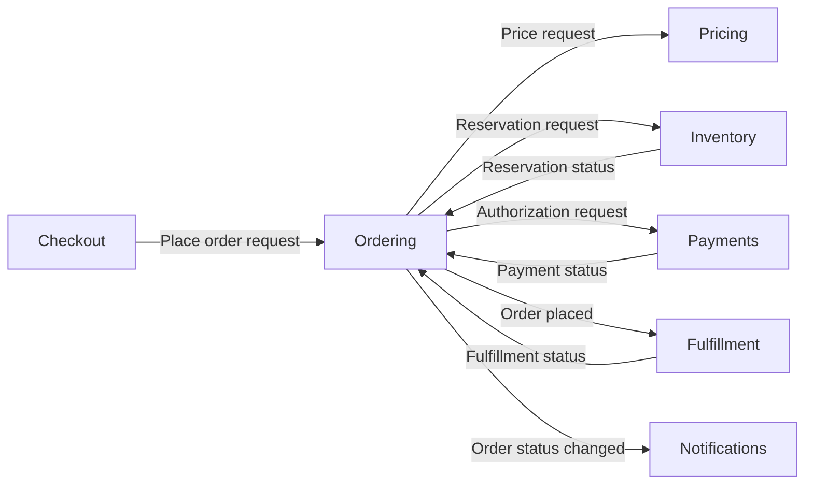

# Component Model Teaching Examples

These are teaching examples, and they are **noncanonical**: they are not part of Groma's
self-blueprint, they do not define product behavior, and they do not replace the canonical
component model under [`../groma/`](../groma/). Every `ent_`, item, and `rel_` ID below is
made up for illustration and must never be reused. Real canonical state is created through
supported public Groma operations, which mint or validate real IDs.

## Recursive Shopify Blueprint

The original product sketch maps directly to the recursive component model. `Shop` and
`Users` are root components of type `domain`; the Shopify blueprint is their workspace,
not a required parent entity. Every nested box is another component with one structural
parent:

```text
Shop [domain]
├── Cart [component]
├── Orders [component]
│   └── OrderItem [component]
├── Products [component]
└── Shipments [component]

Users [domain]
├── Profile [component]
└── Authentication [component]
    ├── Registration [component]
    └── Login [component]
        └── GoogleLogin [component]
```

This hierarchy may continue to any depth. A component can contain children of its own
type or other types, but a child has only one parent and containment cannot form a cycle.
Actions such as `Add item` and `Remove item` are owned by Cart rather than modeled as
child components. Dependencies or flows between any components—including components in
different roots—use ordinary many-to-many relationships and do not affect containment.

## Ordering System

This example shows how a complex TypeScript ordering system should appear at the
architectural level. It does not reproduce packages, classes, handlers, queues, or
storage layout.



The component boundaries express ownership:

- **Ordering** owns the durable order and its business lifecycle.
- **Pricing** owns authoritative purchase prices.
- **Inventory** owns availability and reservations.
- **Payments** owns payment authorization, capture, and refund behavior.
- **Fulfillment** owns delivery of accepted orders.
- **Notifications** owns delivery of customer communications.

The following is an illustrative v0.1 Ordering component nested beneath a Commerce root
component of type `domain`. The path, schema text, and IDs are examples only; this is not
a file in the canonical self-blueprint and must not be copied there by hand.

```md
---
schema: groma/v0.1
id: ent_00000000000000000000000000000010
kind: component
name: Ordering
type: service
parent: ent_00000000000000000000000000000001

desired: present
lifecycle: active

inputs:
  - id: inp_example_place_order
    name: Place order request
    description: >
      A customer's confirmed intent to purchase a priced collection of products.

  - id: inp_example_cancel_order
    name: Cancel order request
    description: >
      A request to cancel an order while its lifecycle still permits it.

  - id: inp_example_fulfillment_status
    name: Fulfillment status
    description: >
      A meaningful change in the progress of fulfilling an order.

  - id: inp_example_payment_status
    name: Payment status
    description: >
      A meaningful change in the payment associated with an order.

outputs:
  - id: out_example_order_placed
    name: Order placed
    description: >
      A durable order accepted for downstream fulfillment.

  - id: out_example_order_rejected
    name: Order rejected
    description: >
      An order that could not be accepted, together with a business reason.

  - id: out_example_order_cancelled
    name: Order cancelled
    description: >
      Confirmation that the order lifecycle reached cancellation.

  - id: out_example_order_status
    name: Order status changed
    description: >
      A customer- or downstream-relevant lifecycle change.

actions:
  - id: act_example_place_order
    name: Place order
    description: >
      Establish a durable order after its price, inventory, and payment conditions
      are satisfied.

  - id: act_example_cancel_order
    name: Cancel order
    description: >
      Cancel an eligible order and coordinate the release of commitments made on
      its behalf.

  - id: act_example_update_progress
    name: Update order progress
    description: >
      Incorporate relevant payment and fulfillment changes into the order lifecycle.

relationships:
  - id: rel_00000000000000000000000000000101
    type: requires
    target: ent_00000000000000000000000000000020
    description: Uses an authoritative price for the purchase.

  - id: rel_00000000000000000000000000000102
    type: requires
    target: ent_00000000000000000000000000000021
    description: Requires products to be reserved before acceptance.

  - id: rel_00000000000000000000000000000103
    type: requires
    target: ent_00000000000000000000000000000022
    description: Requires an acceptable payment state before acceptance.

  - id: rel_00000000000000000000000000000104
    type: informs
    target: ent_00000000000000000000000000000023
    description: Provides accepted orders for fulfillment.

  - id: rel_00000000000000000000000000000105
    type: informs
    target: ent_00000000000000000000000000000024
    description: Provides customer-relevant order lifecycle changes.
---

# Intent

Ordering owns the durable business record of a customer's purchase and its lifecycle
from acceptance through cancellation or completion.

It coordinates the conditions required to place an order, but pricing, inventory,
payment processing, fulfillment, and notification delivery remain separate
responsibilities.

## Behavioral notes

An order progresses through meaningful business states such as pending, placed,
cancelled, and completed. Exact storage, state-machine implementation, event transport,
and API technology are intentionally outside the blueprint.

Order placement must not create two orders when the same purchase intent is submitted
more than once. Cancellation is available only while the order's state and downstream
commitments permit it.

## Guarantees

- Every accepted order has a stable identity.
- The same purchase intent does not create duplicate orders.
- An order is not placed without an authoritative price, inventory reservation, and
  acceptable payment state.
- Meaningful lifecycle changes are available to downstream components.
```

The relationship source is implicit in the owning component file. Everything after the
exact `# Intent` heading and blank line is the component's reversible intent string. The
behavioral notes and guarantees above are therefore intent prose, not additional
frontmatter fields or new schema.

The structured frontmatter remains limited to intent-adjacent identity, inputs, outputs,
actions, and relationships. Richer concepts remain readable without making them mandatory
schema:

| Ordering concept                             | Representation                       |
| -------------------------------------------- | ------------------------------------ |
| Order lifecycle state                        | `Behavioral notes` prose             |
| Pricing, inventory, and payment requirements | `requires` relationships             |
| Idempotency and acceptance guarantees        | `Guarantees` prose                   |
| Place-order trigger                          | `Place order request` input          |
| Rejection and cancellation outcomes          | Outputs                              |
| Reservation and payment effects              | Relationship and action descriptions |
| Fulfillment and payment events               | Inputs                               |

A TypeScript scanner might observe only this partial evidence:

```text
component candidate: packages/ordering
actions: placeOrder, cancelOrder, updateFulfillmentStatus
relationships: imports pricing, inventory, payments
```

A framework-specific scanner might additionally observe an HTTP input or an emitted
order event. The TypeScript and framework-specific scanners are both partial: neither is
expected to infer lifecycle meaning, idempotency, business guarantees, or why these
responsibilities form separate components. Those remain human- or agent-curated intent.
