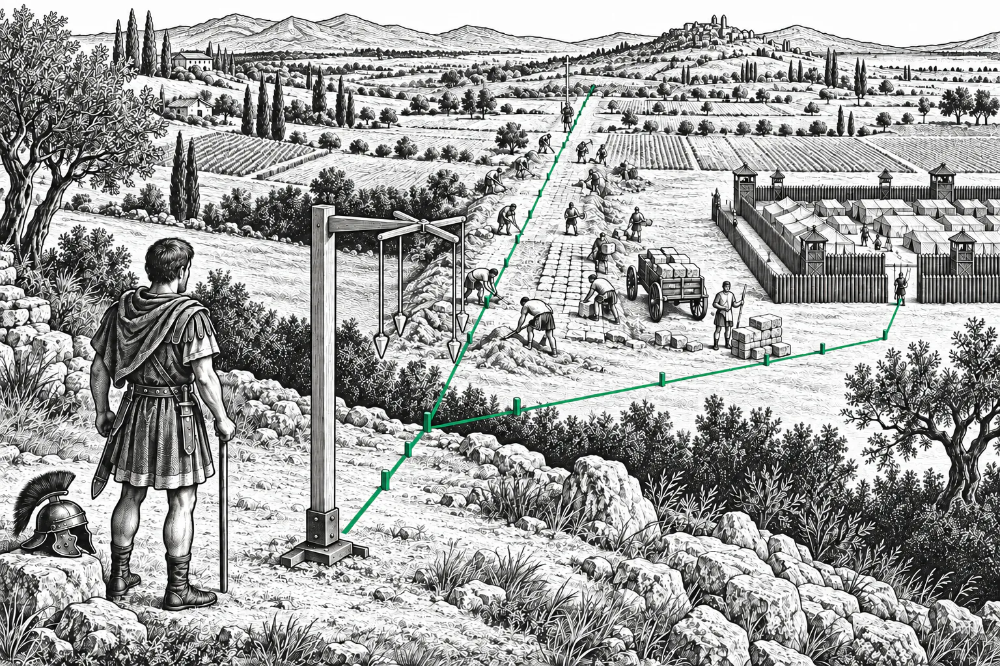
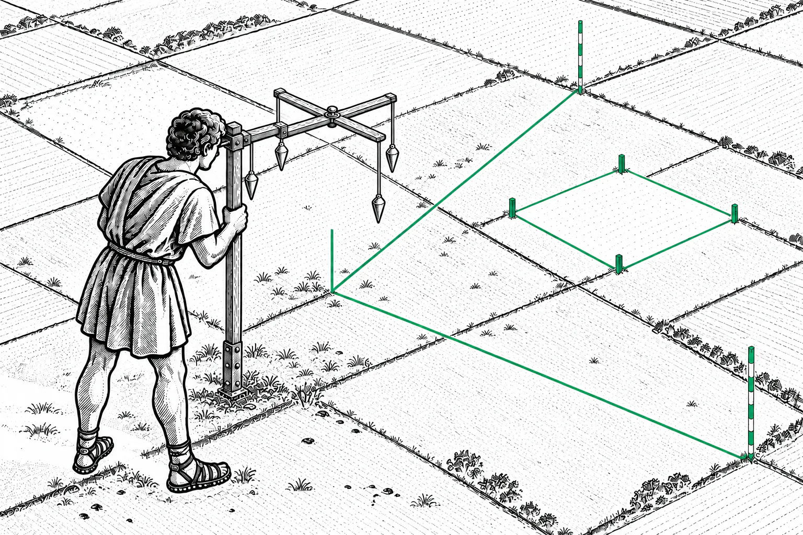
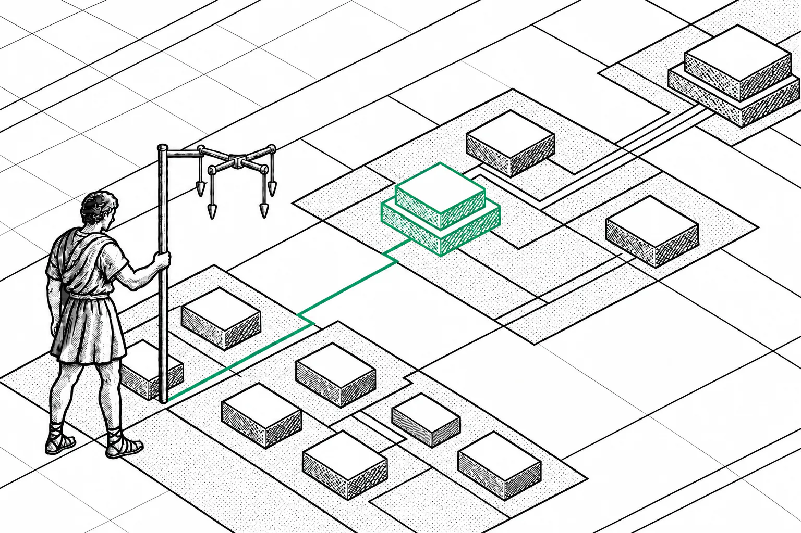

# What is a groma?

<picture>
  <source media="(prefers-color-scheme: dark)" srcset="../.github/assets/what-is-a-groma/road-dark.webp">
  
</picture>

A groma is the instrument Roman surveyors used to mark straight lines and right angles on the ground. Groma is named after it.

## How it works

<picture>
  <source media="(prefers-color-scheme: dark)" srcset="../.github/assets/what-is-a-groma/instrument-dark.webp">
  
</picture>

A groma is a tall staff with a flat cross on top that can turn. A plumb line with a weight hangs from the end of each of the four arms.

The surveyor looked past two opposite plumb lines at a rod held by an assistant and had the rod moved until it lined up with both. That fixed a straight line. The other pair of plumb lines gave the line at a right angle.

## What the Romans laid out with it

Roman land surveyors were called gromatici, after the instrument. They laid out straight roads, army camps, new towns, and centuriation, the square grid the Romans used to divide farmland. Army surveyors marked out the camps, and legionaries helped build the roads. The groma is the only Roman surveying instrument with surviving examples; one was found at Pompeii.

## Why Groma is named after it

<picture>
  <source media="(prefers-color-scheme: dark)" srcset="../.github/assets/what-is-a-groma/map-dark.webp">
  
</picture>

A groma turned a plan into lines on the ground that builders could follow. Groma does the same for software: it keeps a project's architecture as a map that people and coding agents read and follow while they change the code. Drafts stay dashed until a scan finds their code and you accept them, like a camp staked out before its tents go up.

The map uses the groma's geometry. Everything stands on a square grid, and relationships run along it with right-angle turns. The one green color is the surveyor's sight line: it marks your selection and the flows you follow.

Many Roman roads outlasted the empire that built them. Groma keeps its map as plain Markdown in your repository, so your architecture outlasts Groma too.
