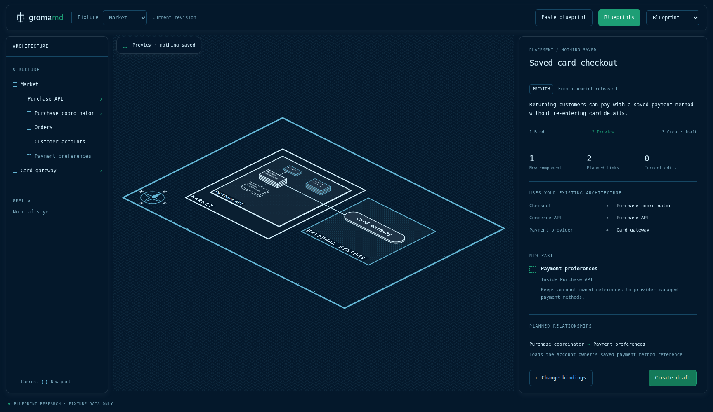

# Blueprint placement: execution results

TASK-324 · Research prototype · 8 September 2026

**Tested source:** `b90464649c46e3010e7db5f55aa59ac389ecb100`. [Successful verification run](https://github.com/MrLesk/Groma.md/actions/runs/34197530648). Subsequent commits add this report and finalize the research task; they do not change the tested application.

## Delivered

One bundled saved-card blueprint can be copied through the browser clipboard, pasted into a differently named project fixture, bound to existing responsibilities and an explicit host container, previewed on the real Groma renderer, and saved as an independent fixture draft. The nine images below were captured from those working controls.

The core clipboard loop is real. Public store hosting, arbitrary draft extraction, production Groma writes, scanner matching and acceptance are not implemented. The prototype persists fixtures in browser localStorage. Ordinary `groma web`, the architecture Markdown contract and production source modules remain unchanged.

## Verification

| Check | Measured result |
| --- | --- |
| Dedicated research lint | Passed |
| Dedicated research TypeScript project | Passed |
| Blueprint domain tests | 30 passed; 0 failed |
| Full `bun run check` | Passed; 110 Node tests and 385 Bun tests |
| Browser assertions | 36 passed; 0 failed |
| Build | Self-contained HTML generated and SHA-256 recorded |
| Screens | 8 desktop captures at 1728×1000; 1 narrow capture at 430×932 |

The 30 domain tests are included in the Bun repository count, not additional unique repository tests. Tool versions: Bun 1.4.1, Node v22.23.2, Python 3.12.14; browser engines: chromium 143.0.7499.4, firefox 144.0.2, webkit 26.0.

Chromium exercises native clipboard copy and keyboard paste, ambiguous binding, preview/cancel, persistence/reload, repeated imports, unchanged current evidence, invalid input, sequential stale-save rejection and safe re-preview. Firefox and WebKit exercise explicit text import through binding, creation and reload. WebKit automation is not physical Safari/macOS certification. No human usability study or independent-agent review was performed.

Machine-readable [check results](evidence/checks.json), [browser assertions](evidence/browser-results.json), [domain log](evidence/domain-tests.log) and [full repository log](evidence/repository-check.log) preserve actual exit codes and the tested revision. The built HTML hash is `9a1f3a9c7d5f3c79957a9ae053e2a9bd49e44a721b74816a3db3e76635d7b98d`.

## Corrections found during testing

A stale retry could refresh its comparison baseline while keeping old project data, risking loss of another tab's saved draft. A regression was first made to fail, then the operation was changed to reload a consistent snapshot and validate it at save. The browser also follows the displayed cancel/re-preview path and verifies the other draft remains.

Visual inspection found a mobile success overlay covering footer buttons. A bounds-only assertion had missed it. The redundant save toast was removed, copy feedback became an ordinary inspector row, and browser checks now hit-test the buttons while feedback is present.

Sequential stale detection is not atomic compare-and-swap across simultaneous tabs. One localStorage write is not evidence of a production filesystem transaction. The production integration must establish that boundary in core.

## Captured flow

| Screen | What is being exercised |
| --- | --- |
| [01 · Blueprint library](evidence/01-library-light.png) | One bundled catalogue entry, actual current map, Copy and Use actions. |
| [02 · Paste into another project](evidence/02-paste-dark.png) | Native clipboard text in the import dialog; no placement or write yet. |
| [03 · Resolve missing binding](evidence/03-bind-missing.png) | Differently named checkout role needs an explicit choice; parent container is visible. |
| [04 · Preview](evidence/04-preview-blueprint.png) | New ghost and planned relationships on the actual renderer; zero current edits. |
| [05 · Created draft](evidence/05-created-dark.png) | Independent fixture draft with copied intent and local bindings. |
| [06 · Overlapping drafts](evidence/06-overlapping-drafts.png) | Current participant remains unchanged and can be used by two drafts. |
| [07 · Invalid import](evidence/07-invalid-paste.png) | Unsupported text remains available with an error; project is unchanged. |
| [08 · Stale preview](evidence/08-stale-preview.png) | Save refuses to overwrite another tab's changed fixture. |
| [09 · Narrow inspector](evidence/09-mobile-draft.png) | Saved draft at 430px with reachable footer actions. |



## Reproduce

From this branch:

```sh
bun install --frozen-lockfile
bun research/blueprints/build.ts
python -m http.server 8765 --directory dist/blueprint-research
```

Open `http://localhost:8765`. Copy in Shop, switch to Market and paste. Choose Purchase coordinator for the Checkout role, verify the container/provider, preview and create. The built HTML is self-contained; localhost is the tested route because file-URL storage and clipboard policies vary by browser.

For all checks and fresh captures, install the documented Playwright 1.57.0 browsers and run:

```sh
python research/blueprints/verify.py
```

## Product conclusions

**Each local draft can own its participant bindings and planned relationships.** The prototype demonstrates overlapping drafts without adding membership lists to current components. Consider this smaller ownership model before changing the production schema.

**Placement must resolve the parent as well as the peer participants.** A component blueprint cannot omit its container merely because the map computes coordinates.

**The next gate is a production reader/writer round trip, not a public catalogue backend.** Approve one ordinary Markdown example, implement core preview/commit with a version boundary, reload the created draft through Groma's reader, and prove current meaning/evidence survives rescans. Then expose the flow in the main viewer; extraction/publication follows after its privacy and attribution rules are tested.

The broader rationale, OKF/C4 interpretation, limitations and ordered integration gates are in [FINDINGS.md](FINDINGS.md).
